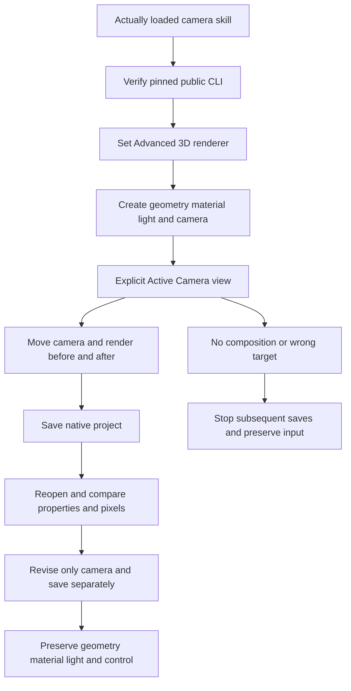

# EffectCraft camera scene architecture and technical design

The normative authority is EC-CM-001-CAMERA-SCENE in establish-v1-plugin. Independent skills own local scene plans, command-family guidance and the pinned CLI installer. The plugin consumes an immutable skill release. The native runtime remains official 0.2.0.

The skill-local create/reopen/revise plans bind returned IDs. The 128×96, 12 fps, one-second fixture has no external media dependency: a 36-pixel cube, Ambient light, two-node camera and green 2D control layer. The control is not affected by camera projection.

Native camera_tool edits the camera only in Active Camera view. Other views edit transient viewer state; a layer argument does not replace this prerequisite. Two-node dolly translates both position and point of interest. Creation exercises orbit/pan, resets explicitly, then advances 50 pixels: camera z changes from -250 to -200 and POI z from 0 to 50. Rendered projection grows from 40×40 to 50×50. Revision retreats 25 and preserves zoom, the focus-to-POI expression, disabled DOF, material, light and control. Persisted properties are compared separately from query time.

The guide classifies all 46 owned commands across geometry, materials, views, camera motion, focus, rigs and video solving, with exact parameter-query entrypoints. Video solving requires real footage and completed solve state; a static camera scene cannot establish solve acceptance.

The source candidate uses one copied skill, system-only PATH and an empty cache with the default public archive. Native creation, reopen, revision and reopen again preserve properties and rendered pixels. No-composition, solid-as-camera and cameraSettings-on-solid failures prevent later saves. Source projects and skill trees remain unchanged. The test requires the actual DOF property to exist, avoiding a vacuous missing-property comparison.

Immutable installed-release acceptance is recorded separately. All 46 command contexts, model/stereo rigs, camera solving, GUI, DOF/shadows and creative quality remain open. Only the bounded camera-scene task may close.
