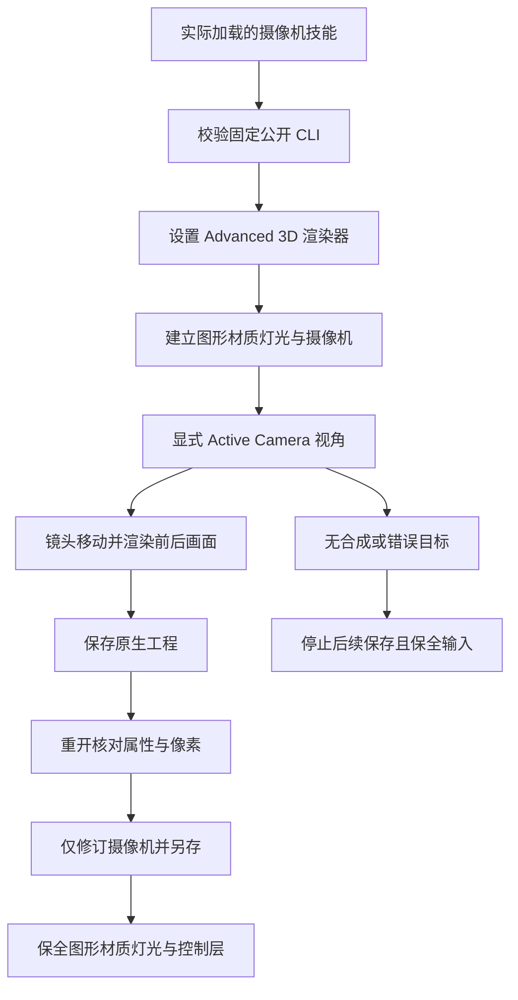

# EffectCraft 摄像机场景架构与技术方案

规格事实源为 establish-v1-plugin 中 EC-CM-001-CAMERA-SCENE。独立技能维护场景计划、完整命令分类与固定 CLI 安装，插件消费不可变发布快照；运行时保持官方 0.2.0。

技能本地 examples 提供 create、reopen、revise 三个命令计划，所有创建步骤用返回 ID 绑定。128×96、12 fps、一秒固定实例无外部媒体依赖，使用 36 像素立方体、Ambient 灯和 twoNode 摄像机。绿色二维控制层用于验收非目标保全；它不受摄像机投影影响。

原生 camera_tool 在 Active Camera 下才写摄像机；其他视角只更新会话视图，layer 参数不能替代此前置。twoNode dolly 同时平移 position 和 poi。创建实例先执行 orbit/pan 并显式复位，再前进 50；镜头 z 从 -250 到 -200，兴趣点 z 从 0 到 50。像素验收投影由 40×40 扩大到 50×50，而非只检查成功回执。修订回退 25，保留 zoom、focus-to-POI 表达式、dof=false、材质、灯光和控制图层。保存属性与瞬时查询时间分别比较。

场景指南分类覆盖摄像机技能完整 46 条归属命令，区分可渲染图形、材质、视图、镜头运动、对焦、绑定和视频解算；每条命令使用实际参数查询入口。视频解算需要真实素材与完成的求解状态，不用静态镜头实例替代解算验收。

源码候选已从单技能副本、系统 PATH 和默认公开制品的空缓存安装运行真实实例；重开、局部返工再重开后属性和像素一致。无合成、把纯色当摄像机、对纯色执行 cameraSettings 三类原生错误停止后续保存，输入与技能树保持。候选测试另核实实际 dof 属性路径，避免不存在属性的空值比较冒充保全。

固定发行安装复验单独记录。全部 46 命令参数上下文、模型与立体绑定、镜头求解、GUI、景深阴影和创作质量仍开放；本实例仅关闭有界摄像机场景任务。
