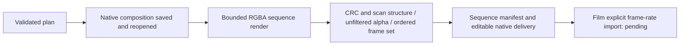

# EffectCraft Dynamic Sequence Architecture

## Authority and state

EC-DM-005-SEQUENCE in the existing OpenSpec change owns this candidate. The independent skill source implements the change; plugin snapshots and native runtime locks retain their published identities until fixed-release verification. Art and Film dynamic integration remain open.

## Contract

The public plan accepts `exports: [{"format":"png-sequence"}]` alongside the existing single MP4 option. It saves and reopens `project.ecproj`, then invokes the fixed native PNG renderer with RGBA channels. `rgba-sequence/sequence.json` uses `craft-image-sequence/v1`: ordered zero-based frame names, byte and reconstructed RGBA hashes, dimensions, 8-bit channels, per-frame alpha extrema, rational frame rate and frame-based duration. PNG representation is straight alpha; color space remains unknown, and full color fidelity is not claimed.

## Failure and resource boundaries

No missing, duplicate, additional, symlinked, malformed, differently sized, non-RGBA8 or fully opaque frame qualifies as transparent delivery. Rendering is limited before native launch to 10,000 frames and 512 MiB of decoded RGBA data. PNG structure and decompression are independently bounded. Per-frame derivatives keep editing-loss reports; the native composition carries editable animation and text. Private temporary paths are not sequence references.

## Native revisions

A text revision starts from the hash-bound existing native project. The source is preserved, the independent badge layer and opacity animation are compared, frame zero stays unchanged and a later changed text frame must differ. Python installation resources are bundled into every independent skill rather than read from sibling skills.

## Acceptance and limits

[Candidate evidence](evidence/dynamic-sequence-candidate-20261006.json): one copied export skill with an empty runtime and default public download passes native first use (14.833s). All 12 frames are independently decoded with Pillow and match reconstructed RGBA digests and actual alpha extrema. Four corruption/completeness/resource tests and the format regression pass; default suite has 32 passes and 19 gated skips. Source and copied skill hashes remain unchanged during execution.

This does not prove Film dynamic import, Art dependency orchestration, new immutable plugin installation, creative review or full V1. The existing Film native importer silently uses its media timebase, so 12 frames become about 0.4 seconds; that defect has a separate native patch and regression gate.

## Fixed-release preparation and current regression

All thirteen source skills contain the complete sequence implementation, preparing skills dev.8 and plugin dev.9 while retaining public native CLI 0.2.0. Repeated [source single-skill cold installation](evidence/dynamic-sequence-source-first-use-20261006.json): one passed with twelve actual RGBA frames and preserved non-target animation during text revision. Existing native MP4 save/reopen/text revision: one passed. Default tests: 32 passed, 19 environment-gated skips. Four integrity/resource checks passed.

[Actual Effect→Film handoff](evidence/effect-film-sequence-handoff-20261006.json) consumes this Effect source skill and public Film craft.2: twelve frames retain one-second duration; independent output decode checks background transparency and graphic colors; targeted text replacement succeeds after moving the Film package and deleting the old intro directory. This still uses an Effect source copy; immutable new Effect installation and Art dynamic dependencies remain pending.

## Installed fixed-release result

[Fixed combination acceptance](evidence/codex-effectcraft9-filmcraft10-dynamic-first-use-20261006.json): isolated Codex 0.153.4 installs Effect plugin dev.9 / skills dev.8 and Film plugin dev.10 / skills dev.9. All 58 skills across five plugins are discovered with zero loading errors. Three real tests consume installed snapshots: single Effect export skill with an empty runtime, public download, twelve independently decoded RGBA frames and text revision; actual two-skill Effect→Film animation handoff, independently decoded MP4, moved project and targeted replacement after deleting old intro input; existing native MP4 regression. Three passed, with all 58 installed hashes unchanged after each test. Art dev.63 still pins old domain bundles. Dynamic mixed integration, actual Skills CLI installation, model dispatch and complete V1 remain pending; task 4.22 stays open.
