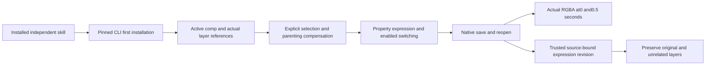

# EffectCraft parenting and expression architecture

The increment adds practical use of native layer.newNull, layer.setParent, prop.setExpression and layer.expressions to every independent skill. All640 commands remain queryable/invocable via commands.py; native.command preserves native parameters and live enabled checks in public workflows. Recipes do not replace exhaustive acceptance.

Every skill owns expression-parent-create.json, expression-parent-revise.json and references/expression-parent.md. Public workflow.py installs the pinned CLI on first use. Install the scenario with `npx skills add full-aigc-skills/effectcraft-skills --skill effectcraft-cli-expressions`; resolve SKILL_DIR from the actual .agents/skills or plugin cache location.

| Command | Parameters/context | Observation |
| --- | --- | --- |
| layer.newNull | Active comp, returned layer reference | Native parent creation/reopen |
| prop.set | Explicit layer, transform/position, two-component value | Zero-position parent |
| layer.setParent | Children layers and parent reference/null; compensates by default; explicit selection | Persisted parent, cycle rejection |
| prop.setExpression | Explicit layer, native path/prop, expression, enabled | Actual alpha at two times and after revision |
| layer.expressions | Explicit layers and boolean enabled | Native disable/enable with final render check |

Time samples are seconds:128x64,12fps,one second, samples0 and0.5. The initial50+time*50 expression yields alpha128/191; source revision25+time*50 yields64/128. Parent/control layer, control pixels, composition and original delivery remain unchanged. Select the prospective child before testing a cycle; missing-selection rejection is a different result from native cycle rejection.

Copy the revision example to a user-owned path and fill manifest.files[project.ecproj]. Use --source for the trusted prior delivery and --output for a new delivery. Editable.ecproj, dependencies, native.json, operation parameters, two previews and exchange loss remain available; installed resources stay unchanged.

Thirteen independent source-candidate cold public installations pass native creation, revision and rejection paths. Regression115 total:88 passed,27 optional skips. [Candidate evidence](evidence/effect-expression-candidate-20261007.json). Fixed installation and updated Art distribution remain pending. All expression-language features, exhaustive640 commands, GUI/model and fullV1 are outside this sample.

Fixed release: plugin21/source19 passes all13 actual installed cold parent/expression workflows, native save/reopen, alpha at two times, source revision, control/original preservation and cycle rejection. All58 installed identities remain unchanged. Four tag CI checks and both exact tagged public ZIPs pass. Art86 still pins Effect18; task8.15 tracks the updated Art bundle. [Evidence](evidence/codex-effectcraft-expression-first-use-20261007.json).
