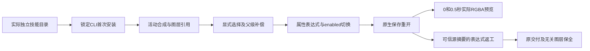

# EffectCraft 父级与表达式架构

本增量把原生layer.newNull、layer.setParent、prop.setExpression、layer.expressions接入独立技能的实际场景说明。640项完整命令仍可由commands.py查询／调用，native.command在公开工作流中保留原生参数与实时enabled校验；新增场景不代替逐命令验收。

每项技能自带expression-parent-create.json、expression-parent-revise.json和references/expression-parent.md，不依赖兄弟技能。首次运行公开workflow.py会安装摘要锁定CLI。安装技能可执行`npx skills add full-aigc-skills/effectcraft-skills --skill effectcraft-cli-expressions`；运行路径来自实际.agents/skills或插件缓存位置，使用自己的SKILL_DIR变量。

| 命令 | 参数和状态合同 | 验证 |
| --- | --- | --- |
| layer.newNull | 当前活动合成；保留返回layer引用 | 原生父级创建和保存重开 |
| prop.set | layer、transform/position、二维value | 父级零位置保存 |
| layer.setParent | 子图层layers及parent引用／null；默认补偿位置；先建立选择 | 父级绑定保全、循环父级拒绝 |
| prop.setExpression | layer、原生path／prop、expression、enabled | 两个时间点实际Alpha及返工变化 |
| layer.expressions | 指定layers和布尔enabled | 原生关闭再开启，并以渲染核验最终状态 |

预览时间单位为秒，示例128×64、12fps、一秒，采样0及0.5秒。初始透明度表达式50+time*50产生Alpha128／191；源返工只改为25+time*50，产生64／128。父级与绿色控制图层、控制区域像素、合成、原交付保持不变。循环检测测试先选择拟设为子级的图层，否则实时选择门禁会先拒绝，不能将不同错误当作同一验收结果。

返工从用户复制的计划填写源manifest.files[project.ecproj]，通过--source绑定可信源、--output输出新目录。保留可编辑.ecproj、依赖清单、native.json、操作参数、两帧预览及交换损失，安装资源不改写。

十三项独立技能源候选分别空运行时公开安装并通过上述实际原生创建、返工和拒绝路径；115项回归中88通过、27明确可选跳过。[候选证据](evidence/effect-expression-candidate-20261007.json)。固定安装与Art新领域分发仍待验证；全部表达式语言、640命令、GUI、模型和完整V1没有由此样例验收。

固定发行验证：插件21／技能源19的十三项实际安装技能均再次从空运行时公开安装并通过父级／透明度表达式创建、原生保存重开、两个时间点Alpha、源返工、控制对象保全及循环拒绝；全部58安装身份不变。四项标签CI与两个公开ZIP精确标签归档核验通过。Art86仍锁定Effect18，新领域包由8.15追踪。 [Evidence](evidence/codex-effectcraft-expression-first-use-20261007.json).
