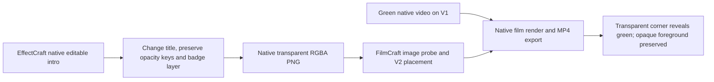

# EffectCraft to FilmCraft Transparent Asset Acceptance

Fixed EffectCraft plugin dev.7 / skills dev.6 and FilmCraft plugin dev.7 / skills dev.6 are used through their actual installed skills. Native CLI versions and immutable release contents are unchanged.

Only one skill per domain is copied into its own directory; each installs into a separate empty runtime. The revised intro keeps its original badge layer and title opacity keys. The invisible-title initial frame is unchanged, while the visible-title frame changes. Original `.ecproj` content and the exported PNG digest stay unchanged after FilmCraft import.

FilmCraft probes the PNG as a Still with alpha, RGBA 8-bit, full-range sRGB transfer and Bt709 primaries/matrix. It collects the asset into the native project, places it on V2 over V1 and saves/reopens before rendering. All 2,423 completely opaque foreground pixels match the original within two channel levels. A transparent corner shows green in both the native preview and decoded MP4; the visible badge pixel retains RGB 239/91/54. This checks actual handoff rather than file extensions or advertised alpha flags.

One live case passes in 13.898 s; all 24 installed EffectCraft/FilmCraft skill digests remain unchanged afterward. Test tools are existing Pillow and ffmpeg, while project rendering/export uses the native engines. The case covers a static PNG and one RGB/8-bit pipeline. Animated alpha video, arbitrary profiles, premultiplied-alpha conversion, model/GUI and full creative acceptance remain unverified. [Fixed identities and hashes](evidence/codex-effectcraft7-filmcraft7-alpha-handoff-20261006.json).
