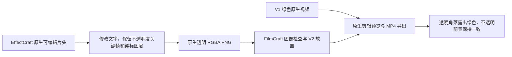

# EffectCraft 到 FilmCraft 的透明素材交接验收

通过实际安装技能使用固定 EffectCraft 插件 dev.7／技能源 dev.6 和 FilmCraft 插件 dev.7／技能源 dev.6。原生 CLI 版本与不可变发行内容保持不变。

每个领域只复制一个技能，各自使用独立空运行时安装。返工后徽标图层与标题不透明度关键帧保持一致；标题尚不可见的首帧不变，可见标题帧发生变化。FilmCraft 导入后，原 `.ecproj` 和透明 PNG 摘要保持不变。

FilmCraft 将 PNG 检查为带 alpha 的 Still，记录 RGBA 8-bit、Full range、Srgb transfer 和 Bt709 primaries／matrix；收集素材入原生工程，放在 V2 并以 V1 绿色视频为底，保存重开再渲染。2,423 个完全不透明前景像素与原 PNG 的每通道差异不超过 2；透明角落在原生预览和 MP4 解码中均露出绿色，徽标可见像素保持 RGB 239／91／54。验证实际交接，不以扩展名或 alpha 声明代替结果。

真实 1 项通过，13.898 秒；结束后 EffectCraft／FilmCraft 全部 24 项原安装技能摘要不变。已有 Pillow 和 ffmpeg 是 QA 工具，工程渲染导出由原生引擎执行。范围为静态 PNG 与一种 RGB／8-bit 管线；动画 alpha 视频、任意色彩配置、预乘 alpha 转换、模型／GUI 及完整创作接受仍未验证。[固定身份与产物摘要](evidence/codex-effectcraft7-filmcraft7-alpha-handoff-20261006.json)。
