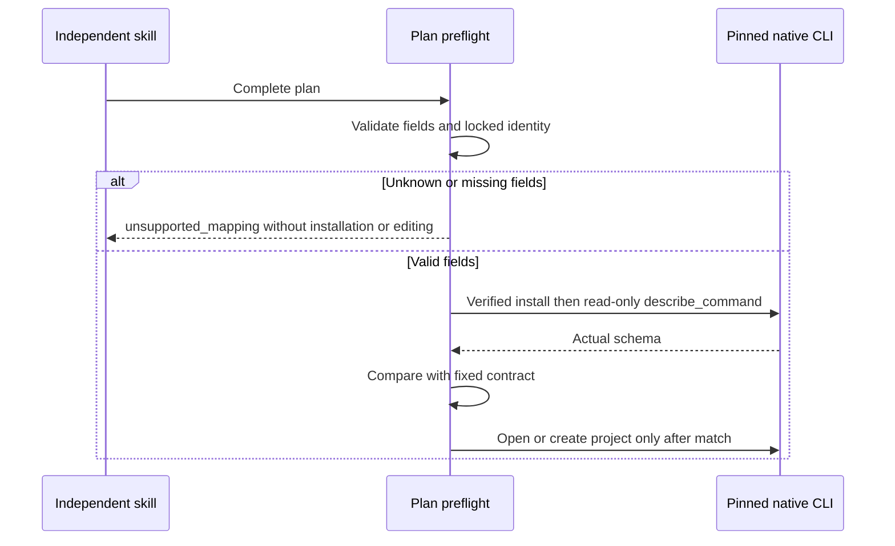

# EffectCraft parameter error architecture

## Scope and authority

OpenSpec EC-DM-004-PARAM owns this increment. Fixed plugin dev.7 / source dev.6 / native CLI 0.2.0 already rejects unknown effect/mask parameters. Actual public cold calls with effect.apply blurriness and mask.new feather confirm native rejection and no delivery. The gap is the helper exposing RuntimeError command_failed instead of the specified unsupported_mapping. This repair does not alter the native engine or silently remove unsupported fields.

```mermaid
sequenceDiagram
 participant S as Single installed skill
 participant W as Workflow
 participant E as Pinned native engine
 S->>W: New or source-revision plan
 W->>E: Execute effect or mask command with all fields
 E-->>W: Exact command-specific invalid parameters error
 W-->>S: unsupported_mapping plus native diagnostic
 Note over W: Discard temporary new delivery; preserve source files
```

## Error mapping and preservation

Only six bounded plan commands qualify: effect.apply, effect.remove, effect.toggle, mask.new, mask.setVertex and mask.remove. The MCP tool must be execute_command, and its single text error must begin with the same command's exact pinned-engine parameter-validation prefix. Other commands, mismatched identities, render/media errors and nonmatching failures retain command_failed. Raw cli.py execution remains the native CLI's explicit validation behavior; this helper classification applies to workflow.py plans.

No second execution strips or retries the parameter. The native command validates before applying its edit. Earlier plan operations can exist only in a private staged project: unsuccessful creation publishes no delivery, and failed source revision preserves every prior file. Existing asset collection failure records remain distinct. Valid creation saves/reopens .ecproj and continues previews/exports.

## Verification and release

The baseline records two actual native rejections with the wrong helper classification. New live acceptance fails with two subtest errors before the repair; two new unit cases also fail. After repair, seven unit tests pass and live effect/mask new/revision acceptance passes in 20.018s using independently copied role skills and empty public native runtimes. [Bound evidence](evidence/parameter-mapping-repair-20261006.json).

All thirteen skills vendor the helper from the independent source authority. Complete source regression, immutable new skill/plugin publication and installed-host verification remain pending at this source milestone. This does not validate every effect, feather animation, model dispatch, GUI or creative quality, and does not change the ArtCraft bundle until its own pinned source update.

Fixed released acceptance now passes: plugin dev.8 carries source dev.7, installed native parameter tests and all 13 independent cold starts pass, and all 58 installed hashes are preserved. [Latest evidence](evidence/codex-effectcraft8-parameter-first-use-20261006.json). This bounded result supersedes the source milestone pending status; ArtCraft propagation and complete V1 remain unfinished.

## Whole-plan preflight increment

Before reading a source project, installing the runtime or creating output directories, the workflow checks unknown top-level and required fields for six effect/mask commands. The self-contained `scripts/parameter-contract.json` is captured from the pinned native 0.2.0 `describe_command` and binds the locked version and binary digest. Native comp/merge fields, layer/layers aliases and deferred `$ref` values remain supported.

After verified installation, the native session reflects each used command before opening or creating a project. A differing schema raises `parameter_schema_mismatch`. Enablement, referenced objects, property paths and parameter values still require native session checks; field preflight does not prove arbitrary effect fidelity.



Candidate regression and fixed release acceptance are recorded separately. This increment does not change ArtCraft's previously locked domain bundle or complete V1 status.

[Preflight candidate evidence / 预检候选证据](evidence/effect-preflight-source-candidate-20261006.json): default 38 passed / 19 gated skips; source native regression 53 passed / 3 skips; focused native first use 1 passed (17.994s); all 13 isolated public plan entry points reject without installing or editing. Fixed release host acceptance remains pending.
