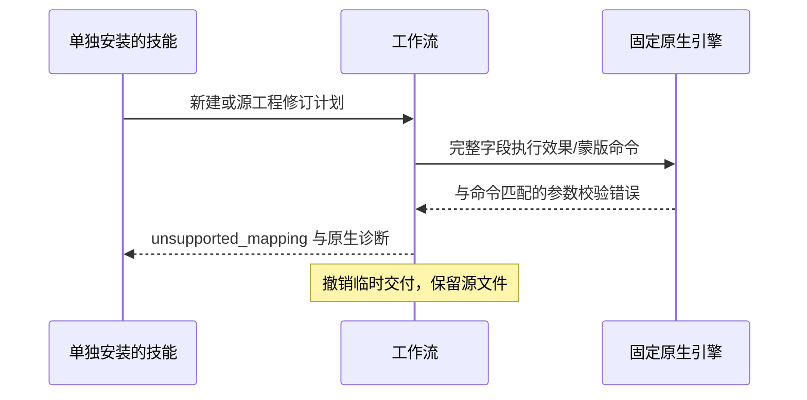
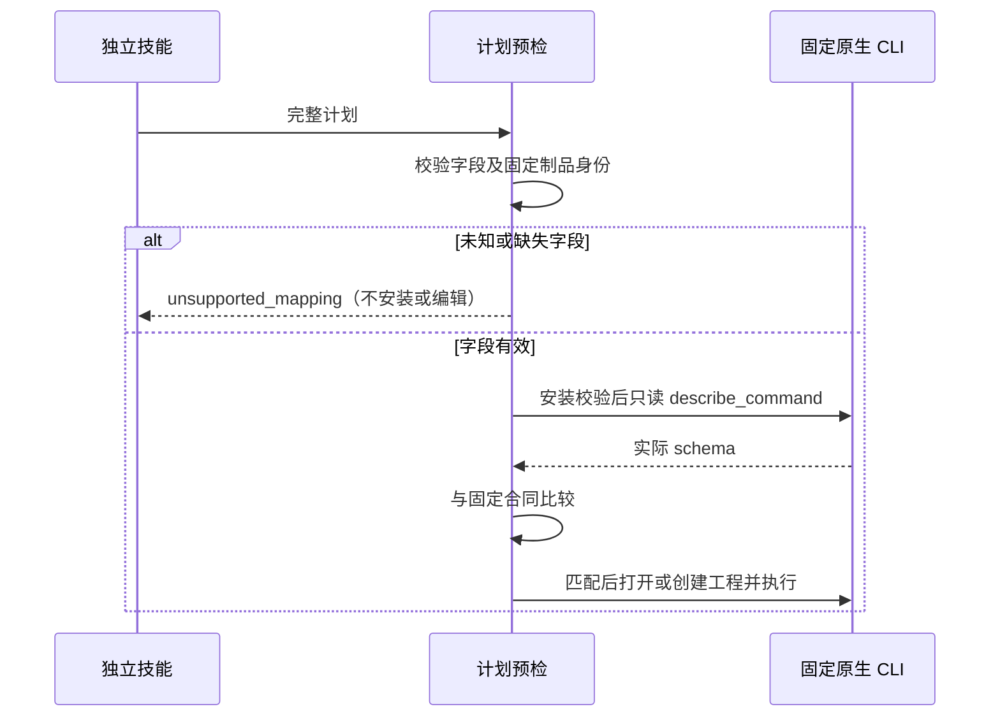

# EffectCraft 参数错误架构

## 范围与事实源

OpenSpec EC-DM-004-PARAM 管理本次增量。固定插件 dev.7／技能源 dev.6／原生 CLI 0.2.0 已拒绝未知效果与蒙版参数。真实公开冷启动的 effect.apply blurriness 和 mask.new feather 请求均被原生引擎拒绝且未交付目录；缺口是技能上报通用 RuntimeError command_failed，而非规范要求的 unsupported_mapping。本修复不修改原生引擎，不删除未知字段后继续执行。

## 分类与保全

限定六条计划命令：effect.apply、effect.remove、effect.toggle、mask.new、mask.setVertex、mask.remove。工具必须是 execute_command，原生错误须是单一文本，并以同一命令的固定参数校验前缀开头。其他命令、身份不匹配、渲染／素材故障及非匹配诊断保留 command_failed。cli.py 原始调用继续使用原生 CLI 的明确校验行为；本次领域错误分类针对 workflow.py 计划。

不省略字段、不二次重试。原生命令在应用该编辑前校验参数；计划较早的操作只存在于私有暂存工程。失败新建不发布目录，失败源修订保留原交付的全部文件。既有素材收集失败记录仍独立保留。有效创建仍保存并重开 .ecproj 后生成预览与导出。

## 验证与发布

旧固定技能实际产生两条原生拒绝，但技能错误分类不符。新增真实测试修复前出现两个子用例错误，新增两个单元用例也失败；修复后目标单元七项通过，独立复制效果／蒙版技能、公开空运行时的有效创建及非法新建／修订验收在 20.018 秒通过。[绑定证据](evidence/parameter-mapping-repair-20261006.json)。

十三项技能从独立技能源同步该助手。本源码阶段尚待完整回归、不可变技能源／插件发布及安装后复验。不据此宣布所有效果、羽化动画、模型、GUI 或创作质量完成；ArtCraft 的锁定包需要其自身的后续更新。

固定发布后验收已通过：dev.8 插件携带 dev.7 技能源，安装后实际领域测试和 13 个独立冷启动通过，全部 58 个安装摘要保留。[最新证据](evidence/codex-effectcraft8-parameter-first-use-20261006.json)。以上源码阶段的待验收状态由该限定范围的结果替代，ArtCraft 传播与完整首版仍未完成。

## 整份计划预检增量

工作流在读取源工程、安装运行时或创建交付目录之前，检查六条效果／蒙版命令的未知顶层字段与必填字段。`scripts/parameter-contract.json` 来自固定 0.2.0 原生 CLI 的 `describe_command`，并绑定锁定版本与二进制摘要；保留原生 comp／merge 通用字段、layer／layers 别名，以及稍后解析的 `$ref`。

有效计划安装并启动原生会话后，再只读核对所用命令的真实 schema；差异返回 `parameter_schema_mismatch`，不打开或创建工程。命令是否启用、引用对象是否存在、属性路径及参数数值仍由原生会话检查，不能把字段预检写成任意效果保真验收。

本增量候选回归与固定发行验收分别记录；不改变 ArtCraft 已锁定的旧领域包或完整首版状态。

[Preflight candidate evidence / 预检候选证据](evidence/effect-preflight-source-candidate-20261006.json): default 38 passed / 19 gated skips; source native regression 53 passed / 3 skips; focused native first use 1 passed (17.994s); all 13 isolated public plan entry points reject without installing or editing. Fixed release host acceptance remains pending.

[Fixed released preflight acceptance / 固定发行预检验收](evidence/codex-effectcraft10-preflight-first-use-20261006.json): plugin dev.10 / source dev.9; 13 isolated cold CLI starts, 13 invalid-plan public entry points, four native regressions and 13 domain tests pass. All 58 installed identities remain unchanged. Art bundle update and full V1 remain open.
