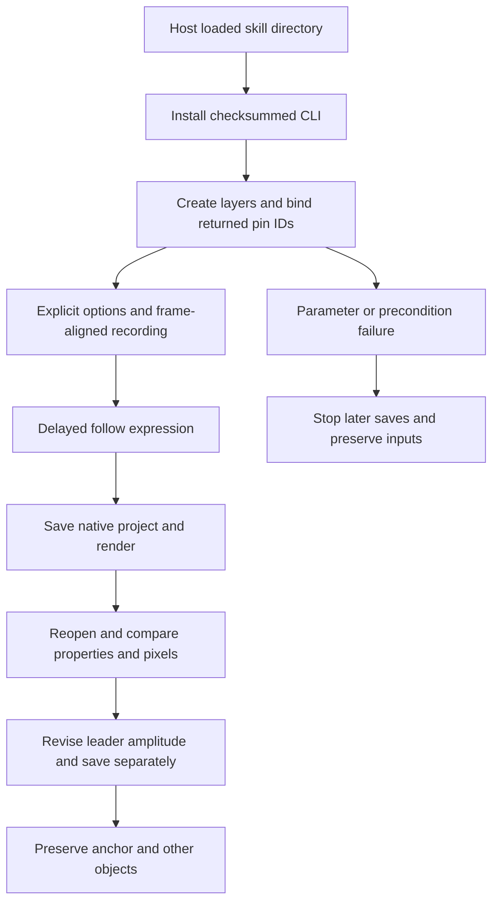

# EffectCraft puppet recording and follow architecture

The normative authority is EC-CM-001-PUPPET-RECORD-FOLLOW in establish-v1-plugin. Independent skills own command plans, parameter guidance and the pinned official CLI installer. The plugin consumes an immutable released skill snapshot. The upstream engine remains official 0.2.0.

Three self-contained plans live inside every skill's examples directory. SKILL_DIR resolves the actual host-loaded directory without sibling skills or a fixed mount. Creation exercises ten representative puppet commands. Reopen and revision accept a project input and use new output directories. The revision pin index belongs only to the fixed fixture; real projects require observed object identity.

Samples use relative seconds and start uses composition time. At 100% speed, zero smoothing and 12 fps, a half-second recording yields seven keys. Follow retains the follower's own position and adds 50% of delayed leader displacement. Selection and recording options are transient session state: set options explicitly before each recording. Persisted properties are checked independently of query time.

The local source candidate passed isolated single-skill copying, public cold installation, creation, reopening, targeted amplitude revision and reopening again. Checks include key times, native expression evaluation, rendered changes/reopening identity, and preservation of source projects, skill files, anchor, follower expression and control layer. No-composition, nonmoving-pin recording and missing-pin failures prevent subsequent save. The first run failed only while summarizing nullable command receipts in the test; the corrected reader passes, with the failed log retained.

This is source-candidate evidence; immutable installed-release acceptance is recorded separately. It does not complete all pin kinds, parameter contexts, GUI gestures, transparent/video delivery or creative review. Full EC-CM-001 and V1 tasks stay open.

Fixed plugin dev.35 / source dev.33 installed acceptance passed: 15 independent cold installs, 64 host identities/discovery and preservation, plus the full fixture and three rejection paths. Only the bounded scene task closes; full domain acceptance remains open.
