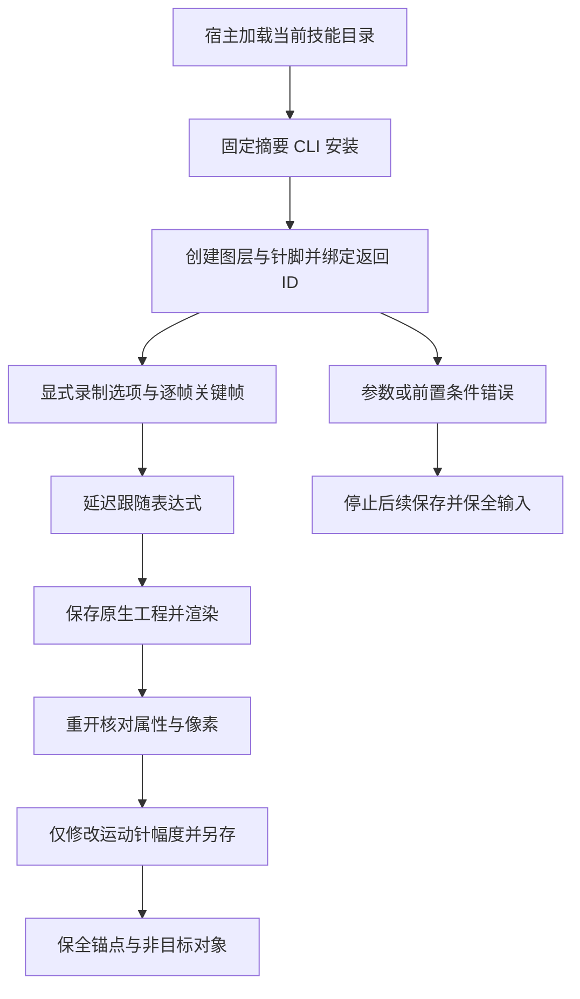

# EffectCraft 木偶录制与跟随架构

规格事实源为 establish-v1-plugin 中 EC-CM-001-PUPPET-RECORD-FOLLOW 场景。独立技能持有命令计划、参数指南和固定官方 CLI 安装器；插件只接收发布后锁定的技能快照。运行时仍为官方 0.2.0，不修改上游引擎。

三个自包含计划位于每个技能自身 examples，脚本通过 SKILL_DIR 指向实际加载目录，不依赖兄弟技能或固定挂载路径。创建计划覆盖全部 10 条木偶命令的代表调用；重开与修订计划接受 project 输入，保存到新的输出目录。修订计划的针脚索引仅对应固定实例，真实任务必须用查询结果确认身份。

录制样本是相对秒，start 是合成时间；100% 速度、0 平滑、12 fps 下，半秒录制生成 7 个关键帧。跟随表达式保留跟随针自己的位置，再叠加延迟的运动针位移乘 50%。录制选项和选择是会话状态，每次录制显式重新设置。保存状态与瞬时查询时间分开核验。

本地源码候选测试已从单技能副本、空运行时缓存及默认公开制品完成创建、重开、幅度返工、再重开；验收逐帧时间、原生表达式求值、像素变化与重开一致性，保全源工程、技能文件、锚点、跟随表达式和其他图层。无合成、不可运动针脚录制、缺失针脚三类错误阻止后续保存。第一次运行仅在测试汇总阶段因回执 command=null 失败；修正读取后完整测试通过，原日志保留。

这是源码候选证据，固定发行安装复验单独记录。全部针脚类型、参数上下文、GUI 手势、透明/视频交付及创作质量未因此完成；完整 EC-CM-001 和首版任务保持开放。
