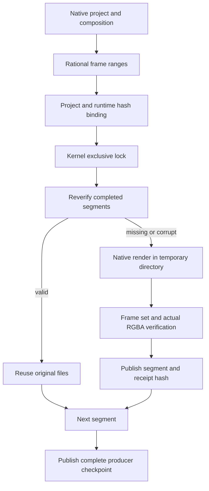

# EffectCraft Segmented Render Architecture

Date: 2026-10-07. Status: independent-source working-tree candidate; released skills dev.9 / plugin dev.10 are unchanged. Authority: EffectCraft plugin `openspec/changes/establish-v1-plugin`, scenario EC-DM-005-SEGMENT, tasks 4.25 / 4.26.

## Problem and contract

The current transparent v1 sequence limits the entire decoded sequence to 512 MiB, approximately 64 frames at 1080p. The candidate splits rendering into bounded segments without increasing the existing v1 limit. Each segment retains actual PNG dimensions, RGBA transparency, encoded hashes and pixel hashes.



Each segment has a global firstFrame and frameCount and reduced rational start/end seconds. Native filenames use composition-global frame numbering; the producer checks the complete native frame set before renaming temporary files to segment-local indices. Actual native output verifies the floating CLI time conversion; extra or missing frames fail.

## Recovery and ownership

`checkpoint.json` binds native project SHA, binary SHA, composition settings, resource budget and ranges. `verified.json` binds each segment receipt. Recovery rechecks receipt identity and independently decodes every frame; changing both pixels and receipt does not qualify for reuse. A changed project or runtime requires a new output directory.

`render.lock` uses a kernel exclusive lock, released when the process exits. A concurrent caller cannot take over. Unknown extra files and symlinks are refused rather than removed. Failed rendering preserves earlier verified segments and does not publish a complete checkpoint.

`segments.json` is an internal `craft-segmented-render-checkpoint/v1`. Child manifests retain `craft-image-sequence/v1`. This producer checkpoint is not automatically accepted by existing Film or Art v1 consumers. Cross-version edit invalidation is also pending; current recovery only reuses verified segments for the same input version.

## Resource limits

| Resource | Candidate boundary |
| --- | --- |
| Decoded bytes per segment | At most 512 MiB; segment size follows resolution |
| Single frame | Reject before install/render if it exceeds segment budget |
| Total frames / logical decoded bytes | 10,000 / 64 GiB; not simultaneous resident memory |
| Verified encoded total | 2 GiB; excess prevents complete publication |
| Native timeout | 180 seconds per segment |
| Paths and concurrency | No symlinks, unknown files or concurrent producer |

The fixed native installation remains macOS arm64. Kernel-lock support does not establish Linux native installation acceptance. Inputs, skill installation and other completed segments remain unchanged.

## First use

Obtain a saved `.ecproj` using the existing workflow, extract the composition object from its native.json into composition.json, and set SKILL_DIR to the actual loaded skill directory.

```bash
python3 -I -B "$SKILL_DIR/scripts/segmented_sequence.py" \
  --project /absolute/input/project.ecproj \
  --composition /absolute/input/composition.json \
  --output /absolute/output/segments \
  --chunk-frames 60
```

The entry installs and verifies the locked CLI without siblings or PATH dependencies. chunk-frames can reduce segment size but cannot increase the 512 MiB budget. Resume with the same inputs, directory and parameters. A text revision requires a new native project and producer directory.

## Evidence and remaining work

[Candidate evidence](evidence/segment-producer-candidate-20261007.json) separates unit, default-suite and native checks. The native fixture is 320×180, 12 fps and twelve frames: three four-frame segments compared independently against one-shot output. It does not prove a full HD long render.

Task 4.26 remains open: integrate public workflow delivery, establish the Art-owned shared consumer contract, implement continuous Film import and Art recovery/moved packages, publish immutable skills/plugins, then verify long intros, text revisions and actual first use. GUI, model dispatch, creative approval and cross-editor color fidelity remain excluded.

## Public workflow integration candidate

The current source workflow accepts `exports: [{"format":"png-segmented","chunkFrames":60}]`; it saves and collects the native project before rendering into rgba-segments, then records the complete imageSequence and all nested PNG exchange records. chunkFrames is optional and cannot bypass per-segment budgets. Invalid fields, chunk values and multiple exports fail before runtime installation. Bounded actual Film collection and Art scheduling now pass candidate integration; task 4.26 remains open for HD and immutable installed first use. See ArtCraft plugin documentation ArtCraft-Segmented-Sequence-Architecture and its version-bound evidence. Historical producer evidence retains its original source fingerprint.

[Art candidate integration evidence](evidence/art-segment-adapter-candidate-20261007.json) binds actual public workflow segment export, Film continuous collection and Art moved revision/recovery. It uses current source and existing verified local native executables; immutable installed cold use and HD remain open.
