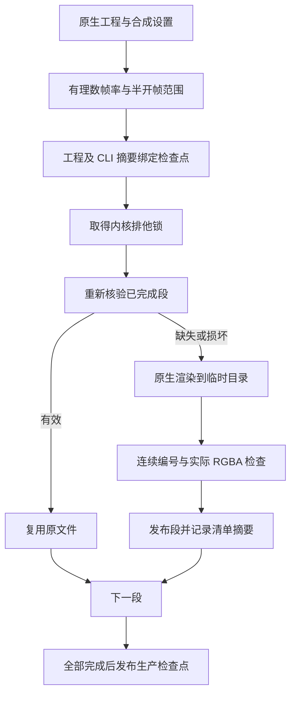

# EffectCraft 分段渲染架构

日期：2026-10-07。状态：独立技能源工作区候选；已发布技能 dev.9／插件 dev.10 内容不变。规格事实源为 EffectCraft 插件 `openspec/changes/establish-v1-plugin`，场景 EC-DM-005-SEGMENT，任务 4.25／4.26。

## 问题与目标

当前 v1 透明序列将全序列解码预算限制为 512 MiB。1080p／30 fps 约 64 帧，无法覆盖通常长度的片头。本增量建立有界分段生产器，保留逐帧尺寸、RGBA、透明度、文件与像素摘要检查；不通过提高原 v1 上限处理长序列。

## 结构与状态



每段按全局 firstFrame／frameCount 切分，start／end 保存约分后的有理数秒数。原生 CLI 使用全局帧编号；只在临时目录核对完整集合后改为段内编号。已有段不会重新编号。CLI 的时间参数边界最终由真实输出帧集合核验，缺帧或多帧立即拒绝。

`checkpoint.json` 绑定工程 SHA、CLI 二进制 SHA、合成设置、预算和分段范围；`verified.json` 记录各段清单摘要。恢复先核对绑定和摘要，再重新解码检查实际帧；即使同时修改帧与段清单，也不能当作原完成段复用。`render.lock` 使用 macOS／Linux 内核锁，进程退出自动释放；运行中的生产器不能被另一个调用抢占。

`segments.json` 使用内部 `craft-segmented-render-checkpoint/v1`，只有全段通过才标记 verified。各子段仍为原有 `craft-image-sequence/v1`。检查点不是现有 Film／Art 已支持的交付协议，尚不能直接导入其原 v1 路径。

## 资源与文件边界

| 项目 | 候选边界 |
| --- | --- |
| 单段解码预算 | 最大 512 MiB，按分辨率推算段长 |
| 单帧 | 超过单段预算时，安装或渲染前拒绝 |
| 总帧数／逻辑解码量 | 最大 10,000 帧／64 GiB，不代表同时驻留内存 |
| 已验证编码文件总量 | 最大 2 GiB；超过不发布完整检查点 |
| 原生段超时 | 每段 180 秒，失败保留此前已验证段 |
| 并行与路径 | 排他锁；拒绝符号链接与未登记额外文件 |

只修改调用指定的生产目录。源工程、技能目录及已验证的其他段保持不变；发现用户额外文件时拒绝，不删除它们。输入工程或 CLI 摘要变化必须使用新目录，不允许复用旧任务。当前默认平台仍为 macOS arm64；不能由内核锁代码推断 Linux 原生安装已验证。

## 首次使用入口

先通过现有工作流获得可重新打开的 `.ecproj`，从该工程的原生 `native.json` 中提取 composition 对象，另存为 composition.json。以实际加载的 SKILL.md 所在目录设置 SKILL_DIR。

```bash
python3 -I -B "$SKILL_DIR/scripts/segmented_sequence.py" \
  --project /absolute/input/project.ecproj \
  --composition /absolute/input/composition.json \
  --output /absolute/output/segments \
  --chunk-frames 60
```

入口按本技能锁自动安装及校验固定 CLI，不依赖兄弟技能或 PATH。chunk-frames 只缩小段长，不提高 512 MiB 上限。恢复使用相同工程、设置、目录和参数；修改文字后使用新工程版本和新生产目录。候选目前复用同一版本的完整段，不声称完成编辑后跨版本段级失效分析。

## 验证与后续

测试和实际结果记录在 [候选证据](evidence/segment-producer-candidate-20261007.json)。实际原生测试用 320×180、12 fps、12 帧，分成三个四帧段与一次性基准逐帧比对；这不能作为 1080p 长片头验收。

任务 4.26 保持开放：还需接入公开工作流交付、定义由 Art 持有的共享消费合同、实现 Film 的连续帧导入和 Art 的段级故障／移动包处理，再发布不可变源与插件，执行完整长片头、文字返工和首次使用验收。GUI、模型派发、创作质量及跨软件色彩保真不由本候选证明。
