# EffectCraft 优化候选交付（2026-10-08）

本文件保留各候选阶段的限定证据，本次分发更新为技能源dev.40。继续以 effectcraft-plugin 的 `openspec/changes/establish-v1-plugin` 为唯一规格事实源；插件dev.42通过来源锁消费本次技能源快照。下列结果不代表完整 V1 已完成。

执行代码维护在 `skills/effectcraft-use/scripts/`，生成到全部 15 个技能，各自独立安装，不读取兄弟技能。参考 [当前能力矩阵](current-capabilities.json)、[候选证据](evidence/managed-optimization-20261008.json) 与 [公开使用合同](../skills/effectcraft-use/references/managed-execution.md)。

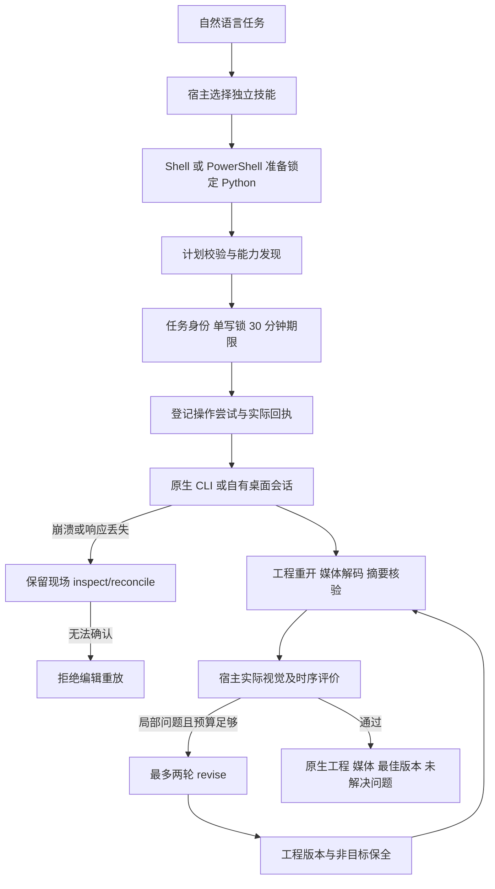

| 范围 | 本次实现与证据 | 尚未关闭的验收 |
| --- | --- | --- |
| 环境准备 | Python 3.13.16、EffectCraft 0.4.0；7 平台固定来源、摘要、Python/运行时文件清单；离线、互斥、暂存发布、系统/libc 前检 | Windows、Linux、macOS x86_64 实机与最低系统边界；Windows 最低系统目前采用保守基线 |
| macOS 桌面 | 固定 DMG 暂存不复制 Finder 扩展属性，随后严格 codesign 验证；旧版本保留 | 本轮全部 GUI 场景和外部用户编辑冲突 |
| 任务控制 | 9 个管理操作，显式 v2 状态、逐操作持久回执、工程/输出单写、未知重复阻断、父子取消、截止时间 | 部分编辑的自动续跑；孤儿进程的跨重启身份接管；分段恢复只完成本机候选验证，其他故障/平台仍开放 |
| 质量与修订 | 工程/媒体/创作/用户接受独立；真实解码；摘要绑定 Judge；两轮、30 分钟、停滞停止、非目标完整比较 | 更多故障注入和跨平台资源限制；裁剪区域与任意关键帧局部修订仍需单独合同 |
| 独立技能 | 15 个技能自包含资源、Codex 发现元数据；15 技能 CLI 发现及 15 项原生场景测试通过 | 所有 15 技能的自然语言模型派发；固定发布包安装验收 |
| Codex | 自然语言选择独立安装副本；原生创作、实际媒体评估、一轮受管理修订、最终交付；来源候选摘要单独保留 | 不等于其他宿主或最终公开发行验收；后续校验增强与原宿主快照差异另行记录 |
| FilmCraft 交接 | 真实透明素材、时间基准、像素合成、原生工程重开与动画保全测试通过 | 所有序列规模、编码、平台的完整交接矩阵 |
| Web | 固定 WASM 安装、回环服务器、真实公开 API 的能力/检查/文件读取适配 | 当前浏览器 GPU device lost；受管理编辑与作品验收未完成 |
| FreeBSD | 固定提交源码、摘要、单独构建/测试入口，失败保留日志 | 无本机目标环境；依赖、完整构建及原生作品未验收 |

## 验证与边界

- 默认回归 193 项：159 通过、34 个显式真实环境条件跳过。另行启用的独立技能 CLI 4 项、原生场景 15 项、EffectCraft→FilmCraft 交接 1 项通过。插件原有 23 项回归、文档校验、OpenSpec strict 校验通过。
- 本轮新增断言包括跨进程锁、损坏归档、未知任务换 ID/运行时重放、状态损坏、取消传播、逐操作回执、过期 Judge、实际图片尺寸与分段元数据、非目标属性/关键帧保全。没有将模拟测试标为目标平台验收。
- 第一轮 Codex 验收暴露网络沙箱限制、绕过修订预算以及透明预览约束；记录失败后修复，再做第二轮真实自然语言验收。最终工程和视频技术检查 PASS、创作 PASS、用户接受 false。
- 台式机连接离线；Docker daemon 存储只读，无法创建 Linux 验收环境。没有修改用户服务、删除容器或扩大系统权限。
- 代码未提交、未推送、未发布。插件只新增候选校验和规格映射，正式技能源标签、插件锁和市场更新仍按单独授权进行。

## 继续实施的明确任务

分段恢复本机候选补证见下文；继续补齐跨重启进程接管、桌面外部修改冲突与资源计量，再在可用目标环境运行对应故障和原生任务。Web 受管理写入仍需独立实现。上述代码差距与目标平台不可用是两类不同问题；均保留在原 OpenSpec 变更中，不能以本次 macOS 成功替代。

## 自有进程树守护候选补证

独立守护器已接入受管理执行：监督通道断开后继续排空自有进程组，写入生命周期回执，核对流程在生命周期锁占用或证据不完整时拒绝续写。macOS 的真实进程树与独立技能原生创建/重开/12 帧解码通过，当前技能摘要与证据一致。见 [组件证据](evidence/managed-process-guard-component-20261008.json)。Windows Job 通道、守护器被强杀后的接管、分段恢复及完整 9.3 仍未验收。

## 受管理分段恢复候选补证

当前 macOS arm64 候选已将 png-segmented 检查点接入公开 reconcile/resume：同一任务、原工程、运行时、执行资源和输入摘要匹配，且自有进程树已确认停止后，只继续导出步骤，不重发编辑。恢复保留原截止时间、操作ID和历史生命周期回执；再次 resume 已交付任务返回原结果。取消请求、变更工程/运行时、损坏上下文、未知编辑和无停止证据均拒绝续写。

[当前候选证据](evidence/managed-segment-resume-validation-20261008.json)记录212项默认回归（176通过、36条件跳过），实际异常及SIGKILL中断驱动后的恢复各一例：12帧与连续渲染逐帧一致，已完成段字节/inode/mtime、原工程和已完成编辑回执保全。SIGKILL发生在分段之间的验收驱动，不代表原生CLI正在渲染时被杀的验收。素材坏摘要前置失败测试及原生移动/替换回归也通过。旧证据只证明原快照，不证明当前改动。

跨重启守护器接管、GUI外部冲突、完整资源计量、Web受管理编辑、其他目标系统/架构、最终宿主及固定发布继续开放；9.3与完整V1不关闭。

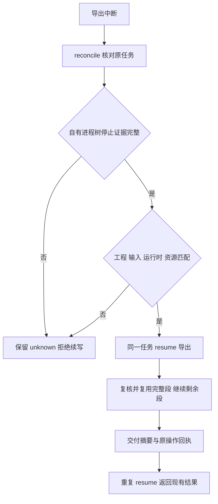

## 祖先任务停止约束候选补证

[组件证据](evidence/managed-ancestor-stop-component-20261008.json)绑定当前源码：副作用调度和新子任务创建前重读完整祖先链，持久取消意图即使进入reconciling仍有效，祖先期限缩短或父链循环均拒绝调度。监督器在自有调用运行期间同样核对祖先约束，先落盘取消再关闭守护通道；未知编辑保持attempted和原身份，不以进程停止当作未执行证明。

三个账本失败用例及一个真实进程失败用例已转绿。默认216项测试180通过、36条件跳过；17项账本测试、启用原生后的6项监督器测试、当前候选的1项原生分段恢复通过，15技能资源一致。原生创建/重开/12帧视频完整解码证据单独绑定技能摘要。此前分段强杀证据属于此前快照，当前变更后重新验证的是异常中断恢复，不冒称已重跑全部故障矩阵。

完整帧数/字节/CPU/内存计量、review/revise父链损坏矩阵、守护器崩溃接管、其他平台、GUI外部冲突、最终宿主和固定发布仍开放，9.3及V1不关闭。

## 共享渲染资源候选补证

受管理workflow在预览/导出前将帧数与解码字节预占到内部 `effectcraft-resource-budget/v1` 根任务账本。父子共享10000帧、64GiB解码量与2GiB编码媒体上限，单次序列原有更严格限制保留。恢复复用相同任务/资源绑定，不重复预占；失败尝试不自动归还。导出阶段观察到的媒体字节以高水位持久化，超限事实先保存再拒绝成功，删文件或重启不能降低已用量。缺少账本的历史任务仅诊断，损坏/悬空预占拒绝续写；跨记录检查和更新共用存储锁。review/revise根任务查询复用带循环检测的父链方法。

[当前组件证据](evidence/managed-resource-component-20261008.json)：9项账本测试覆盖并发子任务、重复预占、越界高水位、旧账本缺失及删除子预占；226项默认回归189通过、37条件跳过。真实原生初次创作与子任务改字导出合计30帧，媒体字节与实际文件一致、原工程保全；单技能原生创建/重开/12帧视频完整解码及分段恢复（12帧连续渲染像素对照）通过，三份证据的技能摘要均匹配当前候选。15技能资源同步一致。

预览在导出上下文形成前中断的占用核对、原生渲染中强杀的临时数据计量、命令计划/桌面计量、CPU/内存、其他平台及最终宿主与固定分发仍开放；此项不关闭9.3或整个V1。此前组件证据只适用于各自快照，当前验证范围以本证据的排除项为准。

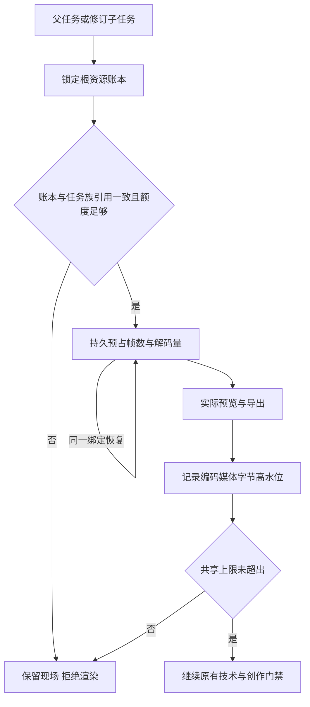

## 崩溃后自有媒体占用候选补证

workflow在首次预览及分段原生调用前登记内部 `effectcraft-resource-locations/v1`：目录路径、设备/inode身份、有限发布别名和媒体种类。监督器实时采样已登记的媒体，进程树确认停止后严格核对；公开reconcile也按原位置计量。主输出与已发布段重复命中同一文件只计一次。目录被替换、活动目录失踪、媒体链接或损坏记录形成UNKNOWN，保留原现场并阻止任务族继续写入。运行中因文件改名导致的短暂FileNotFound等待下一次采样，停止后不得忽略。计量诊断不替代未知编辑的回执。

[当前组件证据](evidence/managed-resource-location-component-20261008.json)：8项位置/故障测试，235项默认回归197通过、38条件跳过。实际原生预览写出后在编辑回执落盘前强杀worker；守护器确认进程树停止，公开reconcile计入原暂存PNG字节，原工程与操作身份保全，resume保持reconciling且不重放。当前单技能原生创建/重开/12帧完整解码及分段恢复再次通过；三份原生证据的技能摘要均匹配当前候选，15技能资源一致。首次验收夹具错误关闭控制管道，修正后重跑；未把夹具错误列为产品红灯。

仍未覆盖原生正在写半帧时强杀、孤儿分段暂存的归档及自动恢复、守护器自身崩溃接管、commands/desktop计量、CPU/内存、其他平台/宿主和固定发布；9.3及V1继续开放。历史证据只证明各自旧快照。

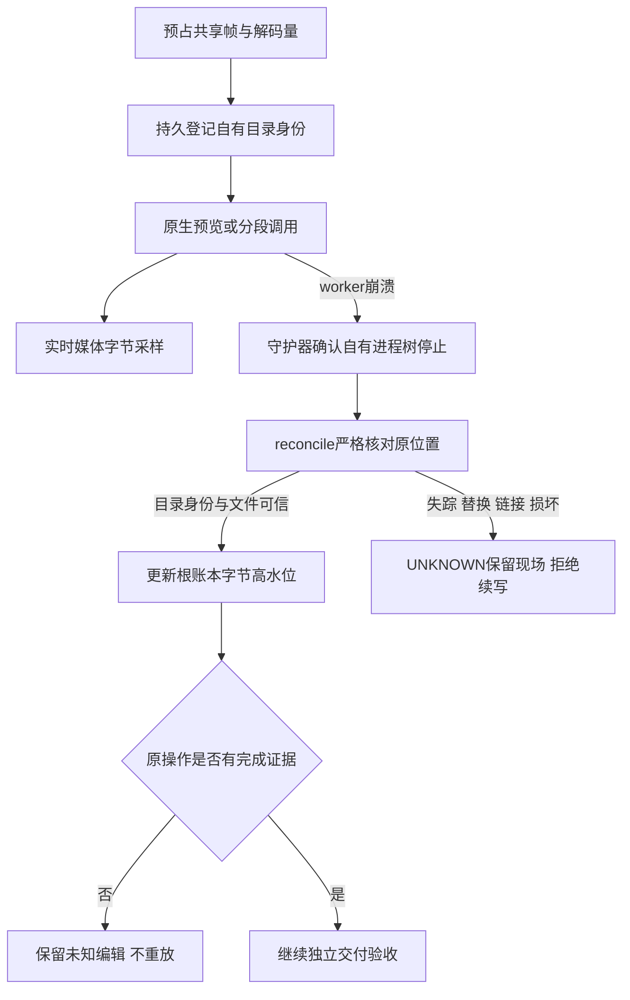

## 孤儿分段归档与再次调用预算候选

已补齐原任务登记的未发布分段恢复。显式resume在确认进程树停止、工程/运行时/检查点匹配后，把残留段通过同文件系统目录移动保存在交付之外的私有位置；内部`effectcraft-orphan-archives/v1`在移动前记录源、目标、目录身份及文件摘要。reconcile只核对原移动结果，源仍在时不发起移动。未知文件、链接、目录替换、目标异常、移动失败或归档内容改变均保留现场并拒绝续写；归档媒体继续计入共享编码字节占用。

资源账本兼容扩展`segmentAttempts`，首次调用由原计划预占覆盖，同段再次原生调用在启动前追加独立尝试及帧数/解码量。完整段复用不追加，相同尝试核对不重复追加；失败消耗和超预算事实跨重启保留，额度不足不启动原生调用。

[组件与原生证据](evidence/managed-orphan-retry-component-20261008.json)包含9项归档测试、7项预算/执行器组合测试，以及真实原生写出4帧后、发布前强杀worker的公开resume案例。首段字节/inode/mtime和编辑回执保持，残留4帧原目录移动后摘要及文件身份保持，12帧与连续渲染像素一致；第二段两次尝试均计量，重复resume不重渲染。普通原生创建/重开及12帧视频完整解码再次通过。

该案例发生在原生CLI已返回、分段尚未发布的边界，不能证明原生CLI写入半帧时的强杀恢复。守护器自身强杀接管、commands/desktop与CPU/内存计量、其他平台/宿主及固定发行继续开放；本轮只关闭OpenSpec任务9.13和9.14的限定组件范围，9.3与V1不关闭。上述旧报告继续仅证明各自历史快照。

## 序列质量复检增量候选

普通与分段序列现重新核对实际帧的编号、摘要、alpha及有理数时间合同，并验证分段工程、连续区间和逐段回执。13项质量测试的11个错误接受断言修复后通过，259项回归221通过、38条件跳过；真实原生普通序列、分段恢复及刷新包摘要后的错误区间拒绝通过。证据 [sequence-review-candidate-20261008.json](evidence/sequence-review-candidate-20261008.json)。该增量尚未替换已发布dev.37技能源/dev.39插件；完整9.4、固定发布复验与V1保持开放。

## 版本评价与最佳结果候选

新增任务族评价账本：固定首次标准，同版本复用请求、相同回执幂等、冲突回执拒绝；根记录原子结算停滞和最佳版本，保留不可覆盖的请求/响应/报告及产物摘要。旧评分无账本时只诊断，不重置预算。14项目标测试、273项回归（235通过/38条件跳过）及真实原生局部修订通过；实际观察标题裁切后只改标题，最终工程/技术/创作通过，用户接受false。证据 [review-ledger-candidate-20261008.json](evidence/review-ledger-candidate-20261008.json)。本轮仅源码候选，dev.39固定插件未变；完整Judge范围合同、宿主/平台与V1仍开放。

## Judge v2与实际宿主观察候选

请求/回执采用显式v2，绑定任务、工程/媒体、标准和范围摘要；范围包含有理数时间基准、半开帧区间和实际请求的样本。观察回执绑定媒体字节摘要、实际查看的帧索引及方法。缺视觉/时序能力或样本覆盖保留NOT_RUN回执，不选最佳、不消耗停滞；旧v1仅诊断读取。技术未验证时不生成不完整请求，同任务可在解码器可用后继续review。

当前Codex实际查看前后各5帧视频及透明预览，经公开入口仅改标题修复裁切，重开/解码/非目标保全、最佳版本和重复回执验证通过；10项合同、23项账本/修订及292项回归（254通过/38条件跳过）通过。闭合9.18、9.4.3、9.4.4限定门禁，完整9.4.2仍待核验过期回执当前状态的CLI输出，9.4.1/9.4与V1保持开放。抽样PASS不代表全帧验收，用户接受false；无新增独立付费模型依赖。当前源与实际验收副本逐文件一致，固定插件仍为dev.39。见[当前候选证据](evidence/judge-v2-candidate-20261008.json)。

公开review拒绝现在显式返回当前创作NOT_RUN与不可接受诊断；保留本次真实技术检查、历史回执和任务状态。6项目标红绿、298项回归260通过/38条件跳过，以及真实原生交付入口复验通过。 [Evidence](evidence/review-rejection-candidate-20261008.json).

视频与素材技术候选完成：312项回归274通过/38条件跳过，实际原生创建与素材收集后的公开review验证缺帧、时间起点、alpha及依赖摘要。9.19仅关闭限定组件，9.4.1、固定分发、其他目标平台与宿主继续开放。 [Evidence](evidence/video-assets-review-candidate-20261008.json).

当前workflow工程检查已使用任务绑定的已安装运行时，临时复制工程及声明素材，实际重开/缺失素材检查/原生结构比较，并前后核对原件摘要。缺运行时或超时NOT_RUN；原生错误/结构变化FAIL；旧PASS回执只保留历史证据，不提升本次创作。revise在扣轮数前执行相同核验；userAcceptance独立NOT_RUN，accepted布尔兼容。325项回归287通过/38条件跳过，当前单技能原生及视觉1轮修订闭环通过。commands/desktop归一化复检、9.4.1、固定分发与其他目标平台继续开放。 [Evidence](evidence/engineering-review-candidate-20261008.json).

## 命令与桌面质量观察候选

9.21限定组件通过：受管理命令及自有桌面共用调用前原生快照、修订号和渲染前后实际素材摘要，内部记录保存在任务状态目录，公开命令计划／回执和用户文件保持兼容。每个当前保存工程核对全部合成与图层，素材在隔离副本重映射后通过原生检查；PNG使用自身渲染版本的尺寸／alpha合同。未保存的渲染版本不归给后来工程，未覆盖输出明确NOT_RUN。

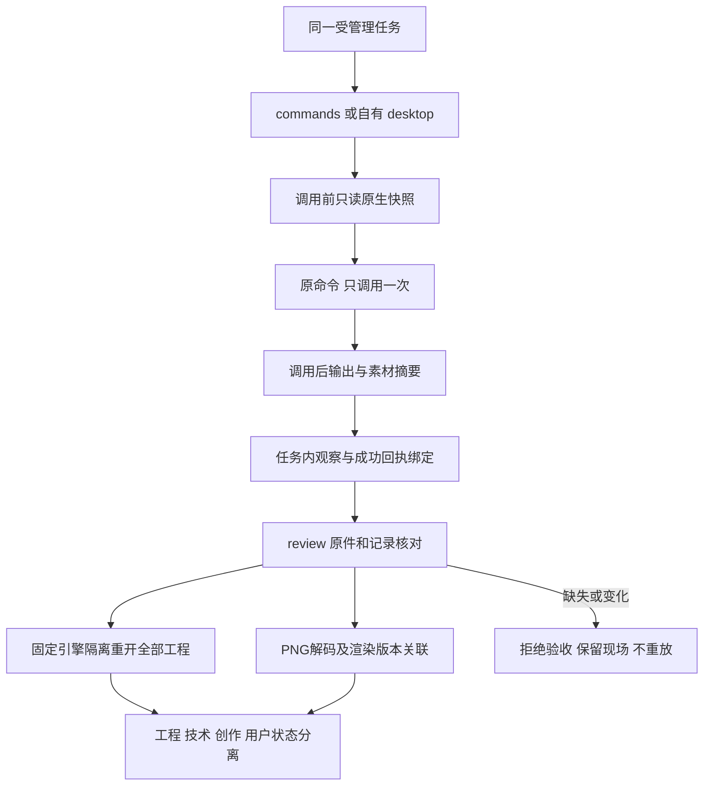

28项目标及353项回归（315通过／38条件跳过）通过。当前独立技能经公开launch分别完成命令与桌面两工程／两PNG／素材用例，14个公开review反例保全现场并在恢复原件后再次通过。桌面监听归属和进程退出已核实；仅复用准备好的缓存，不声明冷安装或模型派发。命令视频／序列、Judge及自动修订、9.3.6、9.4.1与完整V1继续开放；创作／用户接受保持NOT_RUN。本次分发为技能源dev.40／插件dev.42；固定宿主安装派发尚未验收。[候选证据](evidence/command-delivery-candidate-20261008.json)。

## Command and desktop quality observation candidate

Scoped task9.21 passes. Managed commands and owned desktop share pre-call native snapshots, native revision IDs and actual footage hashes before/after rendering, stored only in task state. Public command plans/receipts and user outputs stay compatible. Review independently reopens every current saved project and compares all compositions/layers and isolated dependency copies; named PNGs use their own render context for actual dimensions/alpha checks. A later project cannot substitute for an unsaved render version. Uncovered outputs remain NOT_RUN.

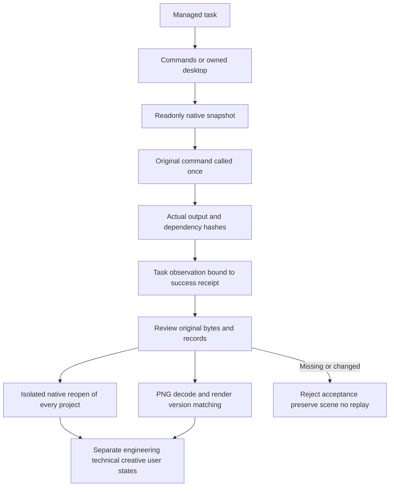

28 targeted tests and353 regressions pass with315 passes/38 conditional skips. The current standalone skill runs both public launch modes with two saved projects, two transparent PNGs and imported footage. Fourteen public-review negative cases preserve original task/output bytes; restoring test originals recovers engineering/technical PASS. Owned listener and process exit are verified. Prepared caches are reused; this is not cold-install or model-dispatch evidence. Video/sequence, Judge and automatic command revision, tasks9.3.6/9.4.1 and fullV1 remain open; creative/user acceptance remain NOT_RUN. This distribution is source dev.40/plugin dev.42; new installed-host dispatch remains unaccepted. [Candidate evidence](evidence/command-delivery-candidate-20261008.json).

## 命令与桌面Judge候选

受管理commands/desktop复用既有Judge v2及不可覆盖任务族账本，内部观察适配保持公开命令计划/回执和用户输出兼容。`scope.contexts`分别绑定合成、原生修订、素材身份、时间基准与所需帧；每个媒体声明context，必须分别覆盖各作品样本并实际观察全部请求媒体，不混合帧覆盖。缺能力/覆盖保留NOT_RUN而不结算评分，重复回执幂等、冲突或过期拒绝；历史PASS不能覆盖当前工程/技术失败，用户接受独立。

10项目标和363项回归（325通过/38条件跳过）通过。当前单技能公开命令及自有桌面原生创建/保存/重开两个运动合成，Codex实际查看8张绑定PNG并比较各合成的两个时刻，随后公开导入评价；两模式各7项拒绝/幂等/当前门禁验证通过，原件/评分保全。只证明具体样本，不声明全帧或插值质量。限定9.22完成；局部revise、视频/序列、固定宿主派发和完整V1保持开放。已发布source40/plugin42快照不变。[证据](evidence/command-judge-candidate-20261008.json)。

## Command and desktop Judge candidate

Managed commands/desktop reuse Judge v2 and the immutable task-family ledger, preserving public plans/receipts and original outputs. `scope.contexts` independently binds each composition/native revision/dependency identity, timebase and required samples. Media references its context; every requested path must be observed and each context must meet its own frame coverage. Missing capability/coverage stays NOT_RUN without settlement. Identical imports are idempotent; conflicting/stale receipts are rejected. Historical PASS does not replace failed current engineering/technical checks; user acceptance stays independent.

10 targeted tests and363 regressions pass:325 passes/38 conditional skips. A current standalone skill creates/saves/reopens two moving compositions through public commands and owned desktop; Codex actually views all8 bound PNGs and compares both declared times per composition, then imports the receipts publicly. Seven rejection/idempotency/current-gate checks per mode preserve originals and settled scores. Only these samples are accepted; no all-frame/interpolation claim. Scoped9.22 closes; local revise, video/sequence, fixed-host dispatch and full V1 stay open. Published source40/plugin42 snapshots are unchanged. [Evidence](evidence/command-judge-candidate-20261008.json).

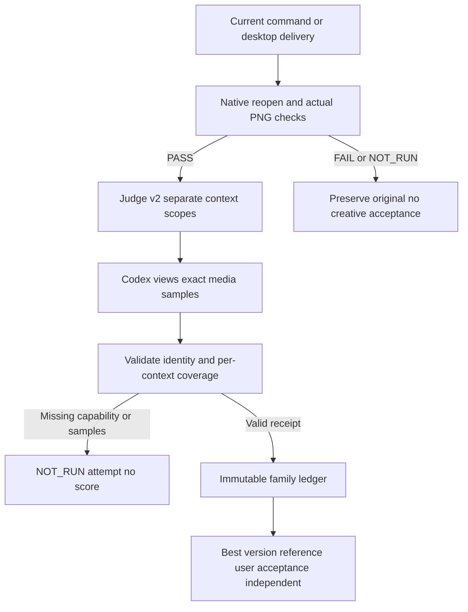

## 命令局部修订开发增量（dev.42 / plugin dev.44）

原任务预先绑定工程、合成、图层与静态属性范围；修订前复核当前评价、原生门禁、版本和共享预算。私有工程种子保留全部原生字段，素材按实际摘要重定位，目标文字仅允许更改文本而保留字体样式。子版本真实重渲染并核对非目标字段、关键帧和未影响合成的实际像素。

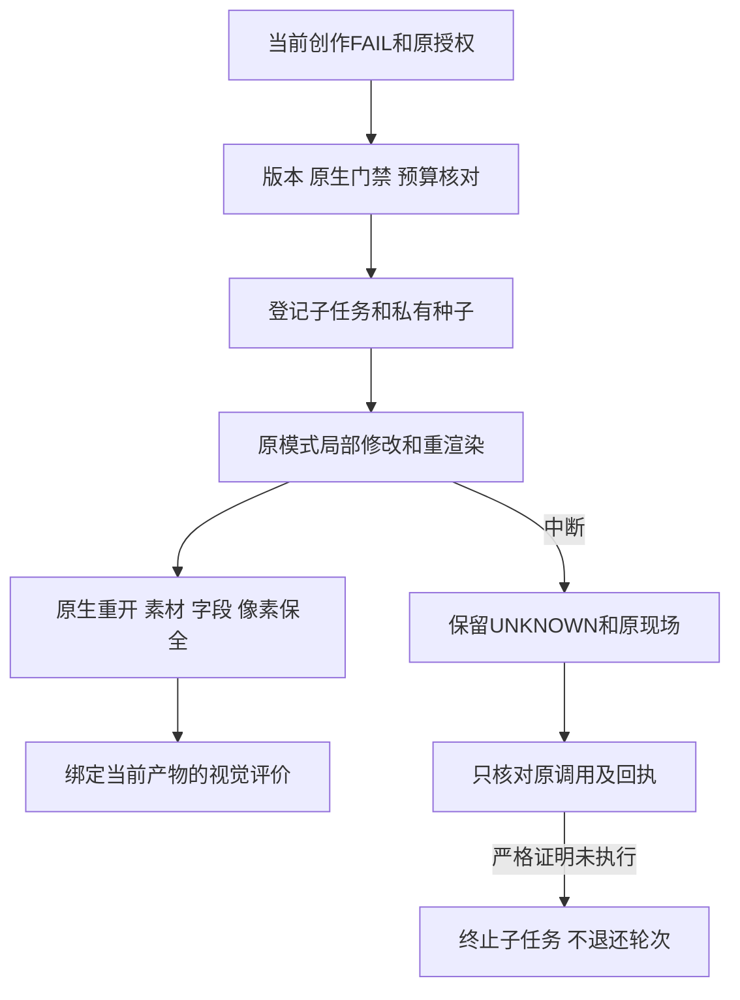

40项目标测试及403项回归（365通过／38条件跳过）；原生命令多合成四样本、带真实导入素材的一样本完成裁切问题修订和复检。桌面第二轮因驱动器500秒超时停止，核对缺少失败回执，保留未知现场，不重发编辑。完整9.23、初始命令资源计量、跨文件结算崩溃矩阵、固定宿主派发与其他平台继续开放。公开协议所有权与旧调用保持兼容。见[当前证据](evidence/command-revision-candidate-20261008.json)。

## 当前桌面修订及结算恢复候选

当前源码新增三个失败用例（2失败／1错误），修复缺回执的明确unknown诊断，以及子任务已终止、根占用未解除的跨文件结算中断。公开reconcile重新核对原证明／调用／种子／停止证据，证明改变则保留占用，不退款、不重放。新增预算防护测试覆盖取消、期限及篡改停滞计数；46项目标测试及409项完整回归（371通过／38条件跳过）通过。

独立桌面标题＋导入素材场景经公开launch完成原生创建、实际裁切观察、一次文字局部修订、保存重开、素材重定位摘要保全及当前视觉PASS。Codex实际查看前后绑定PNG，只评价一个样本，用户接受NOT_RUN。七项实际桌面公开入口拒绝覆盖过期绑定、授权范围、扩大参数、缺运行时、两轮、取消和截止期限；测试故障注入仅作用于自有QA状态并逐项恢复原字节，原件／预算不变。先前超时未知任务原样保留。

初始commands/desktop渲染尚未完整计入任务族资源，过期／取消后结算恢复矩阵、视频／序列、固定宿主派发及其他平台仍开放；9.23暂不勾选。插件运行快照仍是已发布dev.44／source42，本增量未提交或发布。[当前证据](evidence/command-revision-recovery-candidate-20261008.json)。

## 命令／桌面局部修订与共享PNG资源门禁完成（候选9.23）

受管理根计划在原生执行前预占声明PNG帧数，每次渲染在调用前以操作摘要登记原生尺寸解码量；预占与实际尝试取覆盖上界，子版本不重复收费，失败不释放已用量。自有目录身份、显式媒体路径和PNG高水位参与崩溃核对；输入素材／桌面私有缓存不计为输出媒体。路径异常、媒体链接或目录替换保持UNKNOWN。旧任务缺少根帧计量时仅可检查，不补造预算或自动修订。

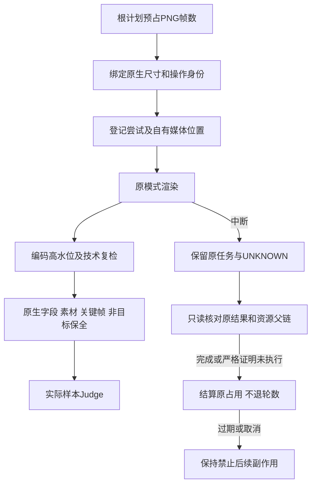

13项资源、50项修订／恢复及426项完整回归（388通过／38条件跳过）通过。commands和自有desktop各从独立技能公开launch完成真实裁切问题→一次文字修订→原生重开／素材与关键帧保全→当前样本创作PASS。每模式实测父子共4帧／245760字节解码量，编码高水位等于父子实际PNG总大小；原始输出不变。Codex实际查看前后各两个时刻，徽标指定区域像素逐字节相同；涉及半透明素材与修改文字重叠的像素不声明完全相同。用户接受NOT_RUN；不代表全帧／插值或逐属性原生验收。

每模式8项公开拒绝验证通过：绑定、范围、参数、缺运行时、资源、两轮、取消及期限；自有QA故障注入逐项恢复原字节。新增过期／取消只读结算测试通过；对先前过期桌面部分编辑的当前公开reconcile明确返回UNKNOWN，保留原输出、两轮预算与占用，不重放。最后的损坏路径诊断修复仅改变resource_meter.validate，使用当前源码副本再次原生／技术复检既有交付通过；历史执行副本保留，证据记录差异。

仅关闭9.23命名的本机静态PNG修订组件；9.3、9.3.6完整资源模式、CPU／内存、视频／序列、动画目标时间范围、逐命令／GUI、固定宿主派发、其他目标平台和V1继续开放。已发布plugin44/source42不变，本增量尚未提交发布。[当前证据](evidence/command-revision-resource-candidate-20261008.json)。

## 命令目录升级差异候选（2026-10-08）

技能源新增离线 `commands.py diff BASELINE.json`；每个独立技能都携带本地实现及固定目录，不读取兄弟技能，不触发下载、安装、任务登记或原生编辑。目录保存655条参数合同／归属／模式路由，以及22个原生工具inputSchema。运行模式字段描述网关路由，实际enabled仍须执行前查询，所有模式验收保持NOT_RUN。

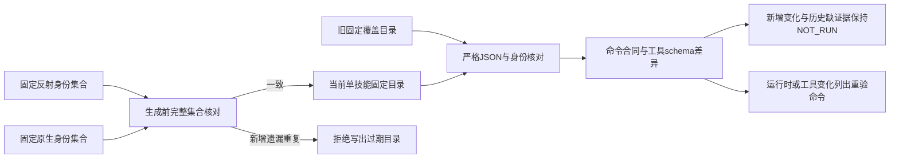

原生只读查询核对锁定EffectCraft0.4.0的655条命令及22个工具schema。对旧source43覆盖目录比较时，655项变化均是本候选新增的模式合同字段，不表示原生新增655种能力；旧目录缺少工具schema，差异输出明确NOT_RUN。15个技能各以单独副本在含空格只读路径通过公开入口，使用隔离Python3.13.16、运行时目录不存在，全部技能文件摘要保持不变。

15项目标测试先红后绿；完整441项回归403通过、38条件跳过。完成组件任务9.24；9.2／9.2.1完整doctor和Web／FreeBSD、逐命令创作、其他平台及固定宿主验收仍开放。新增实现仅在技能源工作区，插件skills/继续保持已发布source43快照，未提交／发布本候选，未改变市场资格。证据：[命令差异候选](evidence/command-catalog-diff-candidate-20261008.json)。

## Command catalog upgrade diff candidate (2026-10-08)

The source candidate adds offline `commands.py diff BASELINE.json` to all15 independent skills. It compares command parameters, owners, workflow mappings, mode routes and native tool input schemas without installation, task registration or native editing. Added/changed contracts never inherit PASS; missing historical schemas remain NOT_RUN. Runtime/gateway changes list commands requiring revalidation. The generator rejects added, missing or duplicate reflected/native identities before writing stale documentation.

Readonly discovery of locked EffectCraft0.4.0 confirms655 commands and22 tool schemas. Comparing the published source43 catalog yields655 mode-metadata additions, not655 new native capabilities; that historical catalog lacks tool schemas. Each single-skill copy passes the public entry under a space-containing readonly path with isolated Python3.13.16 and no runtime directory; installed file hashes remain unchanged.

15 targeted tests pass after expected failures; regression441 total,403 passed/38 conditional skips. Component task9.24 is complete. Full doctor, Web/FreeBSD, every-command creative acceptance, other target platforms and fixed-host dispatch remain open. Plugin skills/ remains the released source43 snapshot; this source candidate is uncommitted/unpublished and does not change marketplace eligibility. [Evidence](evidence/command-catalog-diff-candidate-20261008.json).

## Doctor实际能力诊断候选（2026-10-08）

任务9.2.1的只读诊断与命令目录合同现已验证完成。默认doctor报告平台、锁定／实际Python版本、已安装CLI完整性、655命令目录及可执行恢复argv；它不启动原生进程、不执行恢复。显式`doctor --probe-native`在完整性与最低系统检查通过后，以限时自有空headless会话只查询版本、tools/list及list_commands；坏旧目录优先拒绝，缓存损坏、缺失或条件不满足时不启动CLI。超时不重试，未知任务不恢复。

15个独立技能副本在含空格只读目录实际探测到CLI0.4.0、655命令／22工具schema；15次无Python启动均只读返回缺失。公开Shell入口复验通过，CLI载荷、未知任务记录及技能文件摘要保持不变，原生二进制打开句柄恢复原状。17项目标测试通过；458项完整回归420通过／38条件跳过。结合9.24差异组件关闭9.2.1，当前74项实施任务仍开放。

探测PASS仅证明版本／注册身份／工具schema符合固定合同；创作、desktop、目标平台整体和宿主验收独立保持NOT_RUN。Web／FreeBSD、其他平台原生创作及固定宿主自然语言派发仍开放；插件skills/保持已发布source43快照，候选未提交／发布。前一目录组件章节中doctor开放状态属于该阶段，当前以本节和tasks为准。[证据](evidence/doctor-capabilities-candidate-20261008.json)。

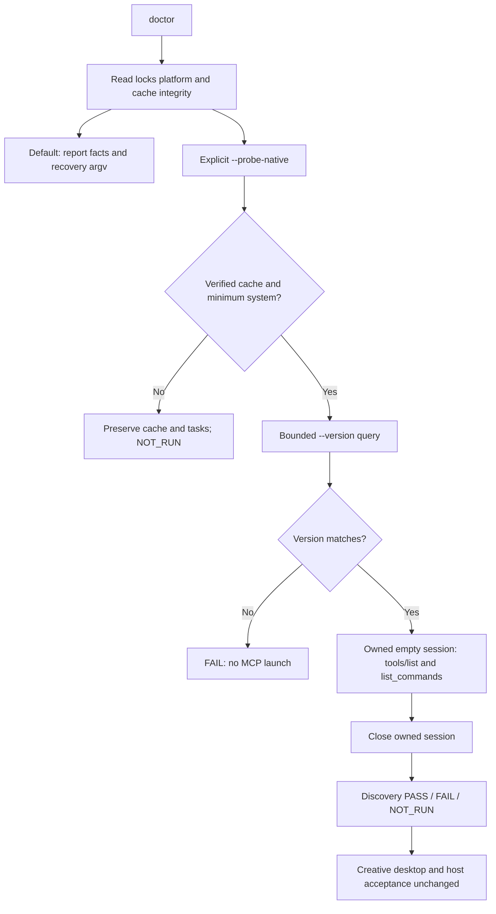

## Actual readonly doctor capability candidate (2026-10-08)

Task9.2.1 is now verified: default doctor reports platform, locked/actual Python, cached CLI integrity, catalog and executable recovery argv without starting native processes or executing recovery. Explicit `doctor --probe-native` checks integrity and minimum system requirements before bounded version/tools/list/list_commands queries in its own empty headless session. Invalid baseline fails before launch; missing/corrupt/incompatible installations are preserved and never started. Timeouts are not retried and unknown tasks are not resumed.

All15 isolated skill copies pass actual readonly probing under space-containing readonly paths (CLI0.4.0,655 commands,22 tool schemas);15 no-Python calls remain readonly. Public Shell entry passes; runtime payload, unknown task records and skill hashes remain unchanged and native binary handles return to their original set.17 targeted tests and regression458 total/420 passes/38 conditional skips pass. Together with9.24 catalog evidence, task9.2.1 is checked;74 implementation tasks remain open.

Discovery PASS is limited to native version/registry/schema identity. Creative, desktop, overall target-platform and host acceptance remain NOT_RUN. Web/FreeBSD, other-platform creative tasks and fixed-host natural-language dispatch remain open. Plugin skills/ still pins released source43; the candidate is uncommitted/unpublished. The previous catalog-component doctor status describes its earlier checkpoint; this section and tasks hold the current state. [Evidence](evidence/doctor-capabilities-candidate-20261008.json).

冷启动恢复补充 / Cold recovery completion: Shell及PowerShell在无Python时也报告准备隔离Python的实际入口argv，不自动执行；POSIX引号路径实测通过。PowerShell显式UTF-8避免恢复路径中文损坏，语法与实际JSON返回分支在本地PowerShell引擎通过；真实Windows主机验收仍NOT_RUN。最终证据绑定两种启动脚本及最终源码；早期456项回归是中间记录，当前有效回归为458项、420通过／38条件跳过。

## 开发分发 dev.44 / Development distribution dev.44

本版纳入已验证的 doctor 和命令差异增量（9.2.1、9.24）；此前候选段落保留阶段记录。未完成运行时绑定草稿不纳入本版；74 项实施任务、固定宿主与其他目标平台验收仍开放。

This release includes the verified doctor/catalog increments (9.2.1 and 9.24). Earlier candidate paragraphs retain checkpoint scope. Runtime-binding drafts are excluded; 74 implementation tasks, fixed-host and other target-platform qualification remain open.

## 任务执行绑定候选 / Task execution binding candidate — 2026-10-09

任务9.25完成限定组件：任务私有执行快照、旧控制器派发、原Python/CLI身份、独立技能入口及损坏拒绝。24项目标测试及482项完整回归（444通过／38条件跳过）通过。15个独立入口先登记完整资源再监督；复制中断保留暂存，历史缺绑定不补建，UNKNOWN工作身份不能因执行版本变化绕过。测试共享回执改用真实平台锁摘要，保留原故障及非目标保全断言。

macOS arm64实际公开resume/review保留原隔离Python3.13.16、EffectCraft0.4.0和代码快照；测试技能锁改成不可用的假设新版本后仍完成原生工程重开和12帧视频完整解码，新任务使用不同代码快照。三个公开损坏拒绝案例保全任务和worker日志。两个真实原生版本升级、跨状态根清理、Windows/其他平台原生执行及固定宿主派发未验收；9.1.4、EC-RT-002和V1保持开放。插件仍锁定已发布source45，候选未发布。

Task9.25 closes only task-private snapshot/original-controller dispatch and fail-closed integrity behavior.24 targeted tests and482 regressions pass (444 passes/38 conditional skips), including registration from all15 independent entries. Actual macOS public recovery/review uses locked Python3.13.16, the original controller and EffectCraft0.4.0 despite a hypothetical unavailable new source lock. Original identity, deadline and snapshot remain unchanged; a new task freezes a distinct code generation. Both native deliveries decode12 video frames. Missing/corrupt/modified snapshots refuse publicly without changing the task or worker log.

This does not qualify two actual native release versions, cleanup across state roots, native Windows/other platforms or installed host dispatch. The Windows adapter uses owned Job/EOF supervision; its portable tests are not native target evidence.9.1.4 and the full requirement remain open; published source45/plugin47 excludes this candidate. [Evidence](evidence/task-execution-binding-candidate-20261009.json).

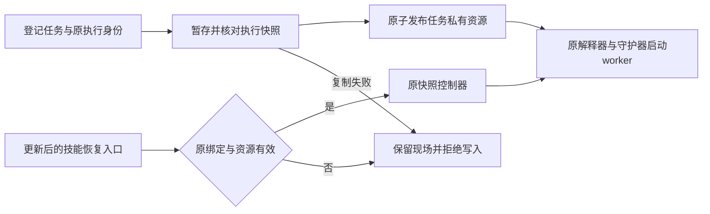

## 2026-10-09 开发发行状态 / Development release status

技能源 dev.47／插件 dev.49 纳入任务执行绑定组件9.25；此前章节的“候选未发布”和旧锁定版本仅描述各自检查点。24项绑定测试与macOS原生恢复证据对应本次执行代码，固定安装后的智能体自然语言派发验收仍开放。两个实际原生版本升级、跨状态根清理、其他目标平台及完整V1不因本次发布关闭。

Source dev.47 / plugin dev.49 includes component9.25. Earlier unpublished-candidate statements describe their historical checkpoints. Publication does not qualify installed-host dispatch, two actual native-version upgrades, global cleanup or full V1.

## 2026-10-09 真实双版本升级与安装回执 / Actual two-version upgrade and installation receipts

安装复用现在核验无歧义UTF-8回执及名称、版本、平台、官方来源、URL、归档／二进制摘要、实际版本输出与载荷锁。doctor、原生工程重开、命令交付及修订核对都传入固定版本／平台；坏回执保留现场，不下载、覆盖或改用其他版本。4项升级组件测试先出现13个目标失败断言，再转绿；7类安装失败保全旧版。完整回归486项：448通过、38条件跳过。

本机官方0.3.1（654命令／21工具的真实只读反射）与0.4.0隔离验收：旧任务的comp.new已成功登记，旧CLI仍持有可执行文件时安装新版；更新单技能文件后旧运行任务继续完成，另一个已登记未执行的旧任务通过公开resume/review完成。新任务绑定0.4.0及隔离Python3.13.16。四份原生工程独立重开与12帧视频完整解码通过，原身份／期限／快照与旧安装摘要保全，生命周期均stopped。坏新版归档另验证旧任务仍能公开恢复和交付。QA仅在旧控制器副本加入“首个图层编辑登记前暂停”门，不改变参数、回执或生产代码；首次验收脚本字段名错误保留，原生任务已正常结束，未重放未知结果。

Receipt reuse now checks unambiguous UTF-8 JSON and the pinned installation identity. Readonly doctor and native engineering/delivery/revision verification pass the pinned version and platform. Invalid receipts remain untouched. Actual macOS old0.3.1 tasks retain their frozen execution and runtime during new0.4.0 installation; old-task public recovery and new-task isolated-Python execution deliver reopened native projects and fully decoded media. Seven portable failure classes are distinguished from the actual bad-archive case.

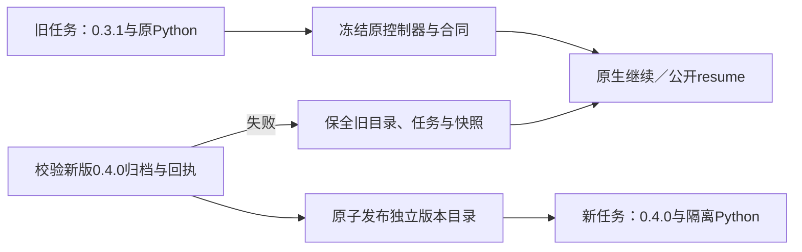

此组件不关闭9.1.4、2.4–2.6、其他目标平台或完整V1：跨状态根清理尚缺实现与证据；旧Python3.13.5仅绑定外部执行文件，不证明旧隔离标准库升级。新候选未提交／发布，插件skills/仍为不可变source47快照；安装后智能体自然语言派发尚未验收。首次暂停是受控测试边界，不等于未知编辑的可恢复证明。[证据 / Evidence](evidence/runtime-upgrade-component-candidate-20261009.json)。

## 2026-10-09 前一检查点：隔离Python双版本与入口失败 / Previous isolated-Python checkpoint

启动前新增Python安装回执校验：非链接文件、固定版本／平台／归档摘要、无额外／重复字段与非法编码；兼容旧入口生成的六种字段顺序和排版。坏回执保留，不调用解释器、不重装。4项POSIX公开入口测试先出现13个失败断言后转绿；PowerShell实际函数在本机19例通过，语法通过，真实Windows执行仍NOT_RUN。3个实际隔离Python坏回执公开doctor反例均保全回执和全部任务文件。

官方install_only制品3.13.15（20260929）和3.13.16（20261003）在同一私有Python根中依次准备。旧task的comp.new已成功、旧CLI和Python仍运行时，原子安装新Python与CLI；旧任务继续或从新技能公开resume/review后仍使用原3.13.15完整载荷与0.3.1，新任务使用3.13.16／0.4.0。两旧一新三份工程重开、12帧视频完整解码通过；原任务身份／期限／快照、旧Python整个发行与旧CLI目录保持。隔离标准库证据来自真实载荷清单及运行时核对，不再以外部Python执行文件代替。

Current launchers reject invalid Python receipts before invoking an interpreter and preserve existing files. Actual isolated3.13.15 and3.13.16 native tasks verify full distribution retention while upgrading official CLI0.3.1→0.4.0. Regression490 total:452 passes/38 conditional skips. PowerShell on macOS proves function contracts only, not nativeWindows qualification.

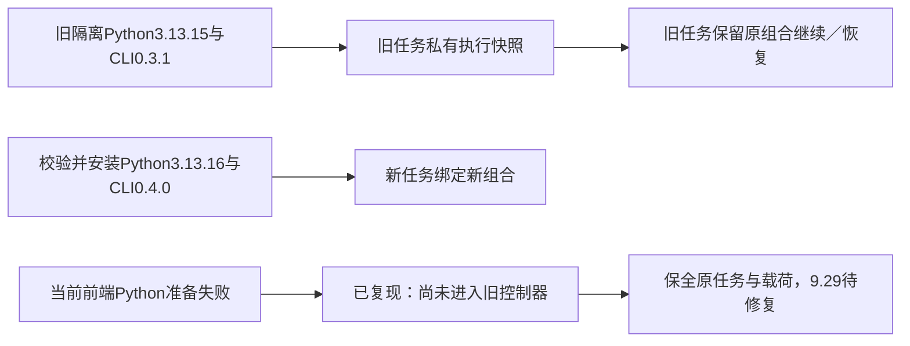

新发现的真实失败必须保留：调用已有old-held的公开resume，指定空的当前Python缓存并提供坏新制品；虽然绑定的旧3.13.15及快照完好，启动器仍先准备当前3.13.16并失败，无法进入原控制器。所有任务文件未改变、未重放编辑。这是9.29／9.1.4的未完成行为，不能用正常升级通过或本轮单元测试掩盖。后续须在当前Python安装之前选择并验证已有任务原执行资源；旧记录没有可信启动证据时保留现场，不能通过当前代码重建旧快照。跨状态根清理、其他原生平台和固定宿主仍开放。[证据 / Evidence](evidence/isolated-python-upgrade-candidate-20261009.json)。

## 2026-10-09 安装前任务派发候选 / Bound task entry candidate

v2执行绑定把固定字段启动描述摘要纳入任务身份。冻结目录原子发布原身份JSON、描述和完整技能快照；POSIX／PowerShell入口在任何当前Python安装或锁读取之前核对顶层原身份、原平台／系统下限、Python回执和完整载荷。只执行当前包内的只读Python校验器，重读原任务与完整快照后交接原控制器及runtimeHome；不执行任务目录里的Shell代码。POSIX采用同PID exec，Windows继续使用原自有Job与stdin所有权通道。当前v1绑定读取及原核验保留；缺少新启动材料的历史记录不隐式迁移、补建或重做。

macOS原生证据：隔离Python3.13.15／EffectCraft0.3.1的v2任务在当前Python缓存为空、坏新归档和坏当前Python锁下恢复；工程重开和12帧媒体完整解码PASS。原身份／截止时间／已完成步骤／冻结快照保全，错误前端runtimeHome被原绑定替代；坏原Python回执在启动解释器前拒绝。最终前端再次只读重开／解码通过，原任务快照仍为此前检查点，不覆盖历史字节。

Windows入口代码与语法、实际PowerShell身份函数8例和回执函数19例在本机验证；不能替代Windows原生入口／进程退出验收。9.29.1仅勾选macOS组件，9.29、9.1.4、跨状态根保留清理、其他目标环境、固定宿主自然语言派发和完整V1仍开放。候选未发布，插件仍固定source48快照。[证据 / Evidence](evidence/task-bound-entry-candidate-20261009.json)。

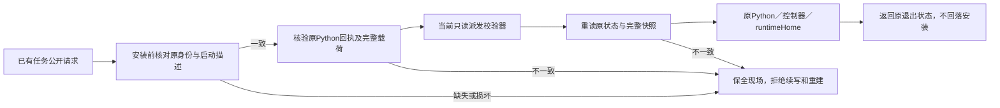
