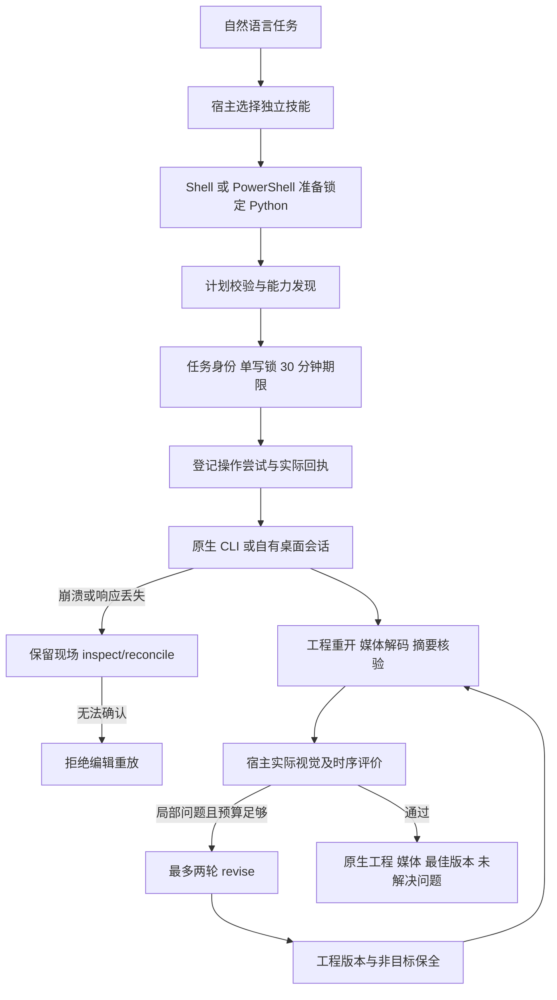
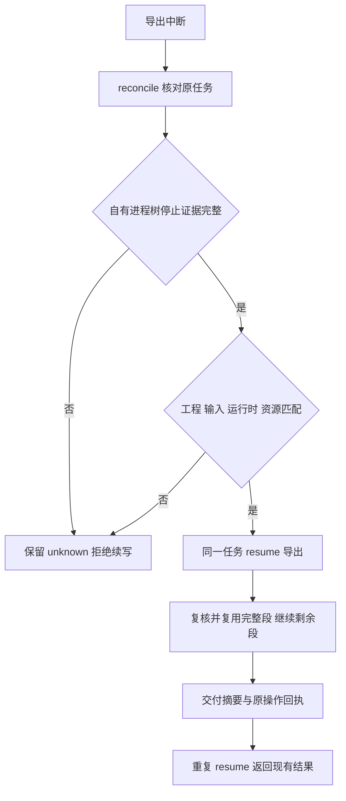
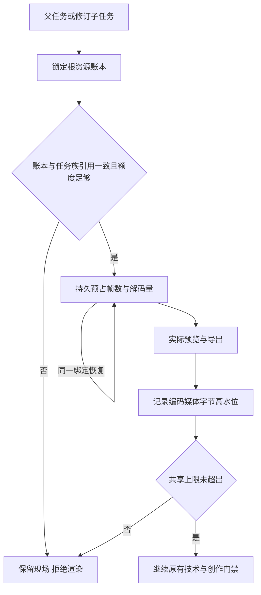
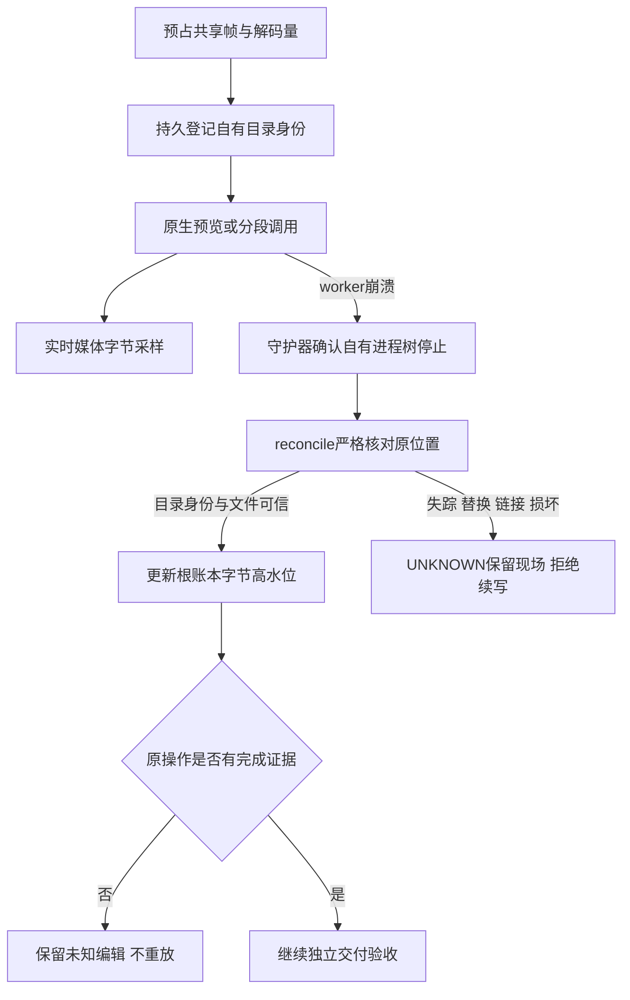
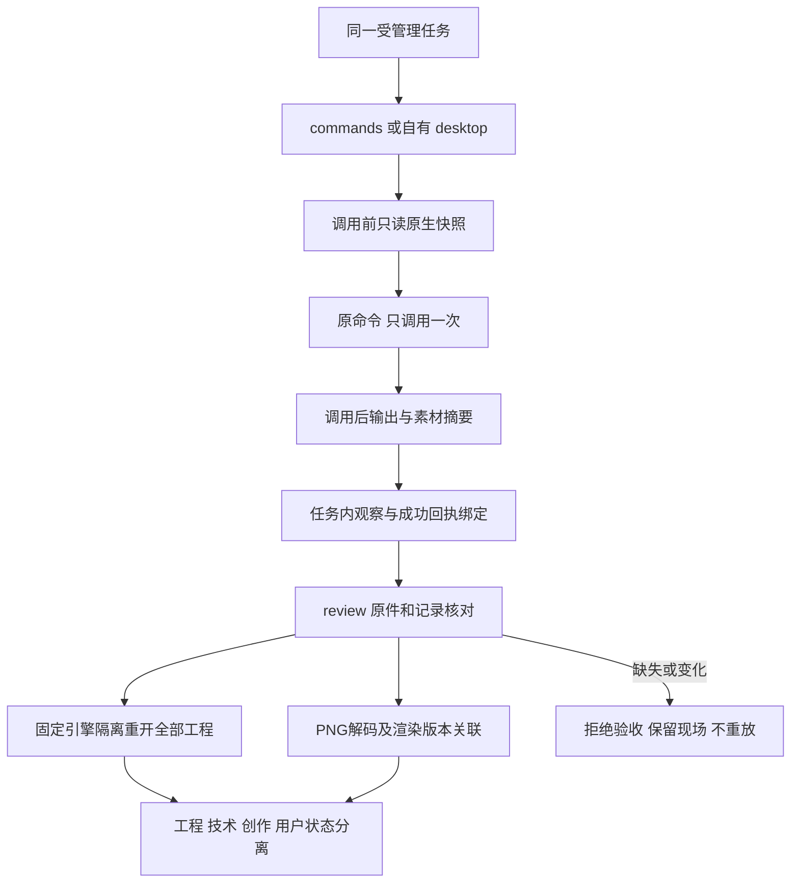
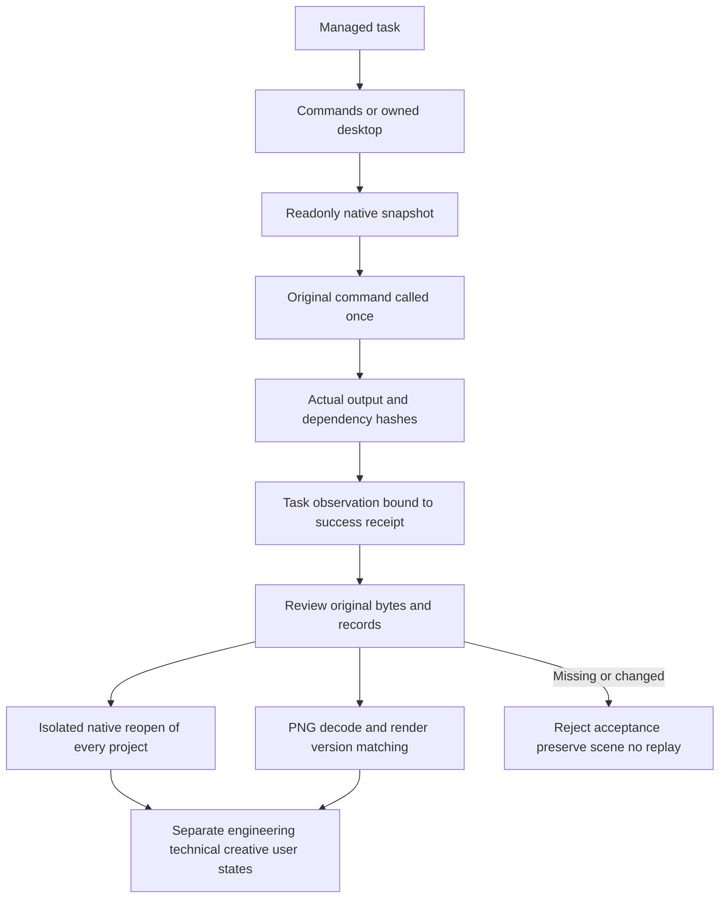

# EffectCraft 优化候选交付（2026-10-08）

本文件保留各候选阶段的限定证据，本次分发更新为技能源dev.40。继续以 effectcraft-plugin 的 `openspec/changes/establish-v1-plugin` 为唯一规格事实源；插件dev.42通过来源锁消费本次技能源快照。下列结果不代表完整 V1 已完成。

执行代码维护在 `skills/effectcraft-use/scripts/`，生成到全部 15 个技能，各自独立安装，不读取兄弟技能。参考 [当前能力矩阵](current-capabilities.json)、[候选证据](evidence/managed-optimization-20261008.json) 与 [公开使用合同](../skills/effectcraft-use/references/managed-execution.md)。

| 范围 | 本次实现与证据 | 尚未关闭的验收 |
| --- | --- | --- |
| 环境准备 | Python 3.13.16、EffectCraft 0.4.0；7 平台固定来源、摘要、Python/运行时文件清单；离线、互斥、暂存发布、系统/libc 前检 | Windows、Linux、macOS x86_64 实机与最低系统边界；Windows 最低系统目前采用保守基线 |
| macOS 桌面 | 固定 DMG 暂存不复制 Finder 扩展属性，随后严格 codesign 验证；旧版本保留 | 本轮全部 GUI 场景和外部用户编辑冲突 |
| 任务控制 | 9 个管理操作，显式 v2 状态、逐操作持久回执、工程/输出单写、未知重复阻断、父子取消、截止时间 | 部分编辑的自动续跑；孤儿进程的跨重启身份接管；分段恢复只完成本机候选验证，其他故障/平台仍开放 |
| 质量与修订 | 工程/媒体/创作/用户接受独立；真实解码；摘要绑定 Judge；两轮、30 分钟、停滞停止、非目标完整比较 | 更多故障注入和跨平台资源限制；裁剪区域与任意关键帧局部修订仍需单独合同 |
| 独立技能 | 15 个技能自包含资源、Codex 发现元数据；15 技能 CLI 发现及 15 项原生场景测试通过 | 所有 15 技能的自然语言模型派发；固定发布包安装验收 |
| Codex | 自然语言选择独立安装副本；原生创作、实际媒体评估、一轮受管理修订、最终交付；来源候选摘要单独保留 | 不等于其他宿主或最终公开发行验收；后续校验增强与原宿主快照差异另行记录 |
| FilmCraft 交接 | 真实透明素材、时间基准、像素合成、原生工程重开与动画保全测试通过 | 所有序列规模、编码、平台的完整交接矩阵 |
| Web | 固定 WASM 安装、回环服务器、真实公开 API 的能力/检查/文件读取适配 | 当前浏览器 GPU device lost；受管理编辑与作品验收未完成 |
| FreeBSD | 固定提交源码、摘要、单独构建/测试入口，失败保留日志 | 无本机目标环境；依赖、完整构建及原生作品未验收 |

## 验证与边界

- 默认回归 193 项：159 通过、34 个显式真实环境条件跳过。另行启用的独立技能 CLI 4 项、原生场景 15 项、EffectCraft→FilmCraft 交接 1 项通过。插件原有 23 项回归、文档校验、OpenSpec strict 校验通过。
- 本轮新增断言包括跨进程锁、损坏归档、未知任务换 ID/运行时重放、状态损坏、取消传播、逐操作回执、过期 Judge、实际图片尺寸与分段元数据、非目标属性/关键帧保全。没有将模拟测试标为目标平台验收。
- 第一轮 Codex 验收暴露网络沙箱限制、绕过修订预算以及透明预览约束；记录失败后修复，再做第二轮真实自然语言验收。最终工程和视频技术检查 PASS、创作 PASS、用户接受 false。
- 台式机连接离线；Docker daemon 存储只读，无法创建 Linux 验收环境。没有修改用户服务、删除容器或扩大系统权限。
- 代码未提交、未推送、未发布。插件只新增候选校验和规格映射，正式技能源标签、插件锁和市场更新仍按单独授权进行。

## 继续实施的明确任务

分段恢复本机候选补证见下文；继续补齐跨重启进程接管、桌面外部修改冲突与资源计量，再在可用目标环境运行对应故障和原生任务。Web 受管理写入仍需独立实现。上述代码差距与目标平台不可用是两类不同问题；均保留在原 OpenSpec 变更中，不能以本次 macOS 成功替代。

## 自有进程树守护候选补证

独立守护器已接入受管理执行：监督通道断开后继续排空自有进程组，写入生命周期回执，核对流程在生命周期锁占用或证据不完整时拒绝续写。macOS 的真实进程树与独立技能原生创建/重开/12 帧解码通过，当前技能摘要与证据一致。见 [组件证据](evidence/managed-process-guard-component-20261008.json)。Windows Job 通道、守护器被强杀后的接管、分段恢复及完整 9.3 仍未验收。

## 受管理分段恢复候选补证

当前 macOS arm64 候选已将 png-segmented 检查点接入公开 reconcile/resume：同一任务、原工程、运行时、执行资源和输入摘要匹配，且自有进程树已确认停止后，只继续导出步骤，不重发编辑。恢复保留原截止时间、操作ID和历史生命周期回执；再次 resume 已交付任务返回原结果。取消请求、变更工程/运行时、损坏上下文、未知编辑和无停止证据均拒绝续写。

[当前候选证据](evidence/managed-segment-resume-validation-20261008.json)记录212项默认回归（176通过、36条件跳过），实际异常及SIGKILL中断驱动后的恢复各一例：12帧与连续渲染逐帧一致，已完成段字节/inode/mtime、原工程和已完成编辑回执保全。SIGKILL发生在分段之间的验收驱动，不代表原生CLI正在渲染时被杀的验收。素材坏摘要前置失败测试及原生移动/替换回归也通过。旧证据只证明原快照，不证明当前改动。

跨重启守护器接管、GUI外部冲突、完整资源计量、Web受管理编辑、其他目标系统/架构、最终宿主及固定发布继续开放；9.3与完整V1不关闭。

## 祖先任务停止约束候选补证

[组件证据](evidence/managed-ancestor-stop-component-20261008.json)绑定当前源码：副作用调度和新子任务创建前重读完整祖先链，持久取消意图即使进入reconciling仍有效，祖先期限缩短或父链循环均拒绝调度。监督器在自有调用运行期间同样核对祖先约束，先落盘取消再关闭守护通道；未知编辑保持attempted和原身份，不以进程停止当作未执行证明。

三个账本失败用例及一个真实进程失败用例已转绿。默认216项测试180通过、36条件跳过；17项账本测试、启用原生后的6项监督器测试、当前候选的1项原生分段恢复通过，15技能资源一致。原生创建/重开/12帧视频完整解码证据单独绑定技能摘要。此前分段强杀证据属于此前快照，当前变更后重新验证的是异常中断恢复，不冒称已重跑全部故障矩阵。

完整帧数/字节/CPU/内存计量、review/revise父链损坏矩阵、守护器崩溃接管、其他平台、GUI外部冲突、最终宿主和固定发布仍开放，9.3及V1不关闭。

## 共享渲染资源候选补证

受管理workflow在预览/导出前将帧数与解码字节预占到内部 `effectcraft-resource-budget/v1` 根任务账本。父子共享10000帧、64GiB解码量与2GiB编码媒体上限，单次序列原有更严格限制保留。恢复复用相同任务/资源绑定，不重复预占；失败尝试不自动归还。导出阶段观察到的媒体字节以高水位持久化，超限事实先保存再拒绝成功，删文件或重启不能降低已用量。缺少账本的历史任务仅诊断，损坏/悬空预占拒绝续写；跨记录检查和更新共用存储锁。review/revise根任务查询复用带循环检测的父链方法。

[当前组件证据](evidence/managed-resource-component-20261008.json)：9项账本测试覆盖并发子任务、重复预占、越界高水位、旧账本缺失及删除子预占；226项默认回归189通过、37条件跳过。真实原生初次创作与子任务改字导出合计30帧，媒体字节与实际文件一致、原工程保全；单技能原生创建/重开/12帧视频完整解码及分段恢复（12帧连续渲染像素对照）通过，三份证据的技能摘要均匹配当前候选。15技能资源同步一致。

预览在导出上下文形成前中断的占用核对、原生渲染中强杀的临时数据计量、命令计划/桌面计量、CPU/内存、其他平台及最终宿主与固定分发仍开放；此项不关闭9.3或整个V1。此前组件证据只适用于各自快照，当前验证范围以本证据的排除项为准。

## 崩溃后自有媒体占用候选补证

workflow在首次预览及分段原生调用前登记内部 `effectcraft-resource-locations/v1`：目录路径、设备/inode身份、有限发布别名和媒体种类。监督器实时采样已登记的媒体，进程树确认停止后严格核对；公开reconcile也按原位置计量。主输出与已发布段重复命中同一文件只计一次。目录被替换、活动目录失踪、媒体链接或损坏记录形成UNKNOWN，保留原现场并阻止任务族继续写入。运行中因文件改名导致的短暂FileNotFound等待下一次采样，停止后不得忽略。计量诊断不替代未知编辑的回执。

[当前组件证据](evidence/managed-resource-location-component-20261008.json)：8项位置/故障测试，235项默认回归197通过、38条件跳过。实际原生预览写出后在编辑回执落盘前强杀worker；守护器确认进程树停止，公开reconcile计入原暂存PNG字节，原工程与操作身份保全，resume保持reconciling且不重放。当前单技能原生创建/重开/12帧完整解码及分段恢复再次通过；三份原生证据的技能摘要均匹配当前候选，15技能资源一致。首次验收夹具错误关闭控制管道，修正后重跑；未把夹具错误列为产品红灯。

仍未覆盖原生正在写半帧时强杀、孤儿分段暂存的归档及自动恢复、守护器自身崩溃接管、commands/desktop计量、CPU/内存、其他平台/宿主和固定发布；9.3及V1继续开放。历史证据只证明各自旧快照。

## 孤儿分段归档与再次调用预算候选

已补齐原任务登记的未发布分段恢复。显式resume在确认进程树停止、工程/运行时/检查点匹配后，把残留段通过同文件系统目录移动保存在交付之外的私有位置；内部`effectcraft-orphan-archives/v1`在移动前记录源、目标、目录身份及文件摘要。reconcile只核对原移动结果，源仍在时不发起移动。未知文件、链接、目录替换、目标异常、移动失败或归档内容改变均保留现场并拒绝续写；归档媒体继续计入共享编码字节占用。

资源账本兼容扩展`segmentAttempts`，首次调用由原计划预占覆盖，同段再次原生调用在启动前追加独立尝试及帧数/解码量。完整段复用不追加，相同尝试核对不重复追加；失败消耗和超预算事实跨重启保留，额度不足不启动原生调用。

[组件与原生证据](evidence/managed-orphan-retry-component-20261008.json)包含9项归档测试、7项预算/执行器组合测试，以及真实原生写出4帧后、发布前强杀worker的公开resume案例。首段字节/inode/mtime和编辑回执保持，残留4帧原目录移动后摘要及文件身份保持，12帧与连续渲染像素一致；第二段两次尝试均计量，重复resume不重渲染。普通原生创建/重开及12帧视频完整解码再次通过。

该案例发生在原生CLI已返回、分段尚未发布的边界，不能证明原生CLI写入半帧时的强杀恢复。守护器自身强杀接管、commands/desktop与CPU/内存计量、其他平台/宿主及固定发行继续开放；本轮只关闭OpenSpec任务9.13和9.14的限定组件范围，9.3与V1不关闭。上述旧报告继续仅证明各自历史快照。

## 序列质量复检增量候选

普通与分段序列现重新核对实际帧的编号、摘要、alpha及有理数时间合同，并验证分段工程、连续区间和逐段回执。13项质量测试的11个错误接受断言修复后通过，259项回归221通过、38条件跳过；真实原生普通序列、分段恢复及刷新包摘要后的错误区间拒绝通过。证据 [sequence-review-candidate-20261008.json](evidence/sequence-review-candidate-20261008.json)。该增量尚未替换已发布dev.37技能源/dev.39插件；完整9.4、固定发布复验与V1保持开放。

## 版本评价与最佳结果候选

新增任务族评价账本：固定首次标准，同版本复用请求、相同回执幂等、冲突回执拒绝；根记录原子结算停滞和最佳版本，保留不可覆盖的请求/响应/报告及产物摘要。旧评分无账本时只诊断，不重置预算。14项目标测试、273项回归（235通过/38条件跳过）及真实原生局部修订通过；实际观察标题裁切后只改标题，最终工程/技术/创作通过，用户接受false。证据 [review-ledger-candidate-20261008.json](evidence/review-ledger-candidate-20261008.json)。本轮仅源码候选，dev.39固定插件未变；完整Judge范围合同、宿主/平台与V1仍开放。

## Judge v2与实际宿主观察候选

请求/回执采用显式v2，绑定任务、工程/媒体、标准和范围摘要；范围包含有理数时间基准、半开帧区间和实际请求的样本。观察回执绑定媒体字节摘要、实际查看的帧索引及方法。缺视觉/时序能力或样本覆盖保留NOT_RUN回执，不选最佳、不消耗停滞；旧v1仅诊断读取。技术未验证时不生成不完整请求，同任务可在解码器可用后继续review。

当前Codex实际查看前后各5帧视频及透明预览，经公开入口仅改标题修复裁切，重开/解码/非目标保全、最佳版本和重复回执验证通过；10项合同、23项账本/修订及292项回归（254通过/38条件跳过）通过。闭合9.18、9.4.3、9.4.4限定门禁，完整9.4.2仍待核验过期回执当前状态的CLI输出，9.4.1/9.4与V1保持开放。抽样PASS不代表全帧验收，用户接受false；无新增独立付费模型依赖。当前源与实际验收副本逐文件一致，固定插件仍为dev.39。见[当前候选证据](evidence/judge-v2-candidate-20261008.json)。

公开review拒绝现在显式返回当前创作NOT_RUN与不可接受诊断；保留本次真实技术检查、历史回执和任务状态。6项目标红绿、298项回归260通过/38条件跳过，以及真实原生交付入口复验通过。 [Evidence](evidence/review-rejection-candidate-20261008.json).

视频与素材技术候选完成：312项回归274通过/38条件跳过，实际原生创建与素材收集后的公开review验证缺帧、时间起点、alpha及依赖摘要。9.19仅关闭限定组件，9.4.1、固定分发、其他目标平台与宿主继续开放。 [Evidence](evidence/video-assets-review-candidate-20261008.json).

当前workflow工程检查已使用任务绑定的已安装运行时，临时复制工程及声明素材，实际重开/缺失素材检查/原生结构比较，并前后核对原件摘要。缺运行时或超时NOT_RUN；原生错误/结构变化FAIL；旧PASS回执只保留历史证据，不提升本次创作。revise在扣轮数前执行相同核验；userAcceptance独立NOT_RUN，accepted布尔兼容。325项回归287通过/38条件跳过，当前单技能原生及视觉1轮修订闭环通过。commands/desktop归一化复检、9.4.1、固定分发与其他目标平台继续开放。 [Evidence](evidence/engineering-review-candidate-20261008.json).

## 命令与桌面质量观察候选

9.21限定组件通过：受管理命令及自有桌面共用调用前原生快照、修订号和渲染前后实际素材摘要，内部记录保存在任务状态目录，公开命令计划／回执和用户文件保持兼容。每个当前保存工程核对全部合成与图层，素材在隔离副本重映射后通过原生检查；PNG使用自身渲染版本的尺寸／alpha合同。未保存的渲染版本不归给后来工程，未覆盖输出明确NOT_RUN。

28项目标及353项回归（315通过／38条件跳过）通过。当前独立技能经公开launch分别完成命令与桌面两工程／两PNG／素材用例，14个公开review反例保全现场并在恢复原件后再次通过。桌面监听归属和进程退出已核实；仅复用准备好的缓存，不声明冷安装或模型派发。命令视频／序列、Judge及自动修订、9.3.6、9.4.1与完整V1继续开放；创作／用户接受保持NOT_RUN。本次分发为技能源dev.40／插件dev.42；固定宿主安装派发尚未验收。[候选证据](evidence/command-delivery-candidate-20261008.json)。

## Command and desktop quality observation candidate

Scoped task9.21 passes. Managed commands and owned desktop share pre-call native snapshots, native revision IDs and actual footage hashes before/after rendering, stored only in task state. Public command plans/receipts and user outputs stay compatible. Review independently reopens every current saved project and compares all compositions/layers and isolated dependency copies; named PNGs use their own render context for actual dimensions/alpha checks. A later project cannot substitute for an unsaved render version. Uncovered outputs remain NOT_RUN.

28 targeted tests and353 regressions pass with315 passes/38 conditional skips. The current standalone skill runs both public launch modes with two saved projects, two transparent PNGs and imported footage. Fourteen public-review negative cases preserve original task/output bytes; restoring test originals recovers engineering/technical PASS. Owned listener and process exit are verified. Prepared caches are reused; this is not cold-install or model-dispatch evidence. Video/sequence, Judge and automatic command revision, tasks9.3.6/9.4.1 and fullV1 remain open; creative/user acceptance remain NOT_RUN. This distribution is source dev.40/plugin dev.42; new installed-host dispatch remains unaccepted. [Candidate evidence](evidence/command-delivery-candidate-20261008.json).
